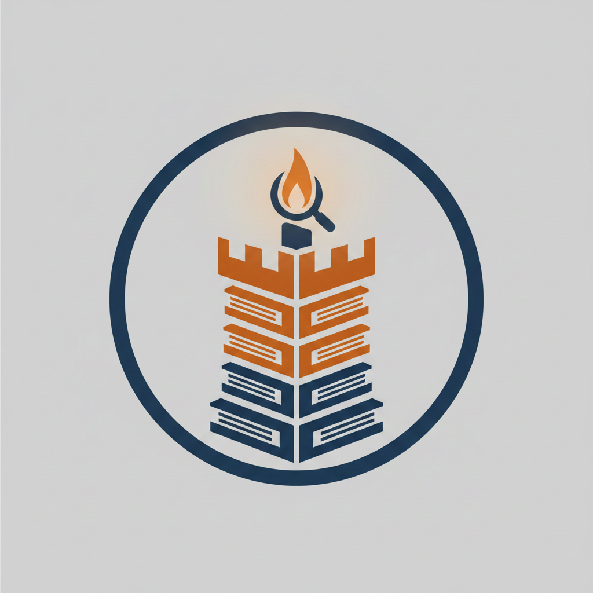

# Candlekeep

*The great library fortress on the Sword Coast, where all knowledge is preserved.*

A RAG knowledge base server that gives AI agents the power to search, retrieve, and manage technical documentation through the Model Context Protocol. Ask a question, and the library answers — with the right scroll, expanded to full context, in milliseconds.

## The Arcane Arts

- [**Bardic Knowledge**](docs/GLOSSARY.md#bardic-knowledge) — Documents are enriched with title and description at ingestion, woven into every embedding
- [**Bardic Inspiration**](docs/GLOSSARY.md#bardic-inspiration) — Result-time metadata boosting that ensures specific technical guides outrank generic content
- [**Arcane Recall**](docs/GLOSSARY.md#arcane-recall) — Intelligent expansion using [**Scholar's Discernment**](docs/GLOSSARY.md#the-scholars-discernment) and [**Arcane Coalescence**](docs/GLOSSARY.md#arcane-coalescence) to return full sections without token waste
- [**Wild Magic**](docs/GLOSSARY.md#lexical-matching-bm25) — Hybrid retrieval merging Vector and BM25 (lexical) search, fixing "keyword blindness" for exact identifiers
- [**The Rosetta Seal**](docs/GLOSSARY.md#the-rosetta-seal) — Corpus-derived BM25 token normalisation map that bridges surface-form variants (`crossencoder` ↔ `cross-encoder`), rebuilt automatically in the background after each ingest
- [**Divine Insight**](docs/GLOSSARY.md#cross-encoder-reranking) — Cross-encoder reranking for when precision matters more than speed
- [**The Relevance Ward**](docs/GLOSSARY.md#the-relevance-ward) — Results below a [configured threshold](docs/ARCHITECTURE.md#tuned-parameters-reference) are filtered, so the library says "I don't know" instead of guessing
- **True Sight** — Images in PDFs and markdown are captioned at ingestion via VLM, making diagram details searchable

## Features

- **[Adaptive Search Routing](docs/ARCHITECTURE.md#the-three-roads)**: Three paths — `simple` (Vector), `hybrid` (BM25+Vector), and `precise` (Reranked)
- **True Sight**: Opt-in vision captioning for PDFs and markdown images — deployment topologies, benchmark charts, and architecture diagrams become searchable
- **Statistical Rigor**: Validated against **The Centurion Set** (100+ multi-category queries)
- **Quality Gate**: Documents must have frontmatter and structure to enter the library
- **Embedding Protection**: Auto-detects model mismatch on remote databases
- **8 MCP Tools**: Search, ingest, critique, generate docs, and more
- **[LLM & True Sight Providers](docs/ARCHITECTURE.md#llm--true-sight-providers)**: Pluggable `anthropic`, `openai`, `bedrock`, and `openai_compat` (Ollama/LM Studio/vLLM) — text and True Sight independently configurable
- **Token Auth**: Bearer token authentication for remote ChromaDB

## Quick Start

### PyPI (Recommended)

The easiest way to get the library up and running for use with any MCP client:

```bash
pip install candlekeep

# Run in stdio mode (standard)
candlekeep

# Run in HTTP mode (recommended for better performance)
CANDLEKEEP_TRANSPORT=http CANDLEKEEP_HTTP_PORT=8111 candlekeep
```

### Docker (Isolated)

Run the server in a container. Note that if your ChromaDB is running on `localhost`, you'll need to use your host's internal IP (e.g., `host.docker.internal` on Docker Desktop):

```bash
docker run -p 8111:8111 \
  -e CHROMA_URL=http://host.docker.internal:8000 \
  ghcr.io/bansheeemperor/candlekeep:latest
```

### Local Development

If you wish to contribute or modify the library's arcane secrets:

```bash
git clone https://github.com/raalgaw/candlekeep.git
cd candlekeep
pip install -e .
./scripts/setup.sh        # Download the tomes (embedding models)
./scripts/configure.sh    # Set your wards (configuration)
./scripts/start_chroma.sh  # Awaken the vault (ChromaDB)
candlekeep                # Enter the library
```

### MCP Client Integration

**HTTP mode (recommended)** — one server, multiple agents. Models loaded once, shared memory, no cold-start per agent (~230ms first query vs ~6s in stdio mode):
```bash
# Start the server once
CANDLEKEEP_TRANSPORT=http CANDLEKEEP_HTTP_PORT=8111 candlekeep
```
```json
{
  "mcpServers": {
    "candlekeep": {
      "url": "http://localhost:8111/mcp"
    }
  }
}
```

**stdio mode** — each agent spawns its own server process. Simpler setup, but each agent pays ~6s cold-start and loads its own copy of the models:
```json
{
  "mcpServers": {
    "candlekeep": {
      "command": "/path/to/.venv/bin/candlekeep",
      "args": [],
      "env": {
        "CANDLEKEEP_SPICE": "true"
      }
    }
  }
}
```

See [Setup Guide](docs/SETUP.md) for auth configuration and production deployment.

## The Tomes (Documentation)

- [Setup Guide](docs/SETUP.md) — Local and remote installation
- [Authentication](docs/AUTHENTICATION.md) — Token configuration
- [Architecture](docs/ARCHITECTURE.md) — System design and technical reference
- [Design Decisions & Benchmarks](docs/DESIGN.md) — Why things are the way they are, with measured results
- [Interactive Benchmark Chart](docs/benchmark_chart.html) — Visual comparison of paths
- [Glossary of Retrieval](docs/GLOSSARY.md) — IR metrics explained in wizard sage style
- [Research Diary](docs/RESEARCH_DIARY.md) — The full journey, every experiment, archived plans
- [The Keeper's Chronicle](docs/THE_KEEPER_OF_CANDLEKEEP.md) — The story of how the library was built

## MCP Tools

- **search** — Semantic search with adaptive routing (`simple` 22–36ms, `precise` ~1550ms)
- **list_documents** — List all indexed tomes
- **get_stats** — Library statistics
- **critique_document** — Check document quality before ingestion
- **generate_documentation** — Scan a project and create structured docs
- **ingest** — Add documents with automatic quality validation
- **delete_document** — Remove a tome from the index
- **repopulate_database** — Clear and rebuild the library
- **rebuild_normalisation_map** — Regenerate The Rosetta Seal from the current corpus after a full repopulate + ingest cycle

Access to write tools is managed by your database permissions (configured via `CHROMA_AUTH_TOKEN`).

## Testing

```bash
# Unit tests — no database required (~1.4s)
pytest tests/test_router.py tests/test_quality_gate.py tests/test_arcane_recall_unit.py \
       tests/test_protection.py tests/test_processor.py tests/test_search.py \
       tests/test_providers.py

# Benchmarks — requires local ChromaDB on localhost:8000
./scripts/start_chroma.sh
pytest tests/test_router_benchmark.py -v -s
```

59 unit tests covering router, quality gate, chunk expansion, embedding protection, document processing, and LLM/True Sight providers. Benchmark tests include regression assertions that fail if precision or content match drops below 80%.

## Requirements

- Python 3.10+
- ChromaDB server (local or remote)

---

<sub>Candlekeep is a trademark of Wizards of the Coast. This project is unofficial fan content and is not endorsed by or affiliated with Wizards of the Coast.</sub>
