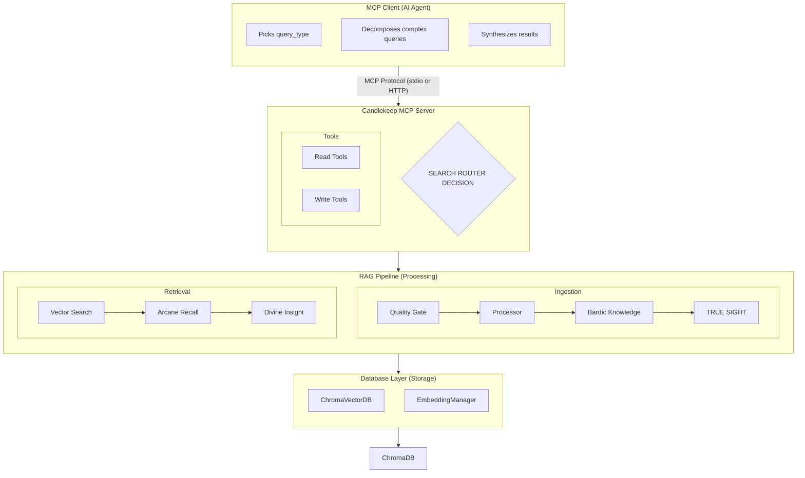
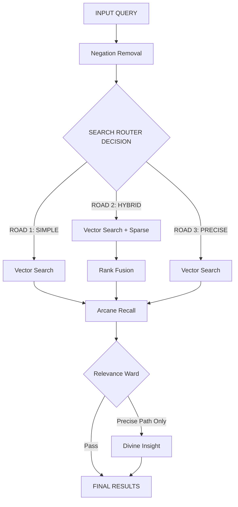
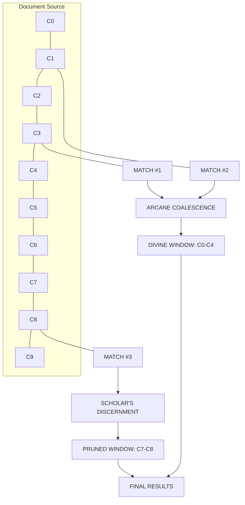
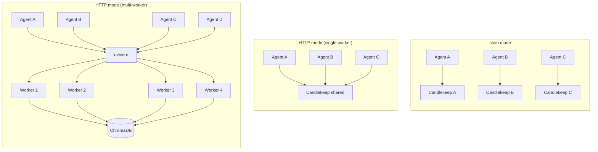
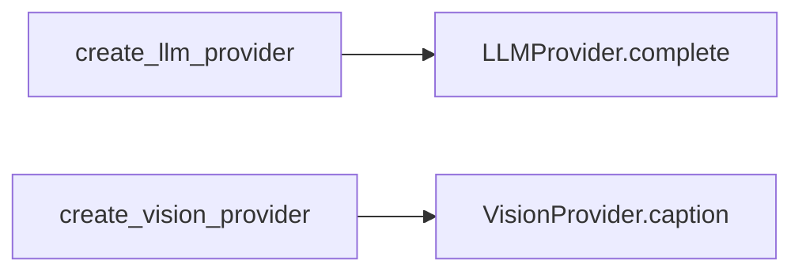

# Candlekeep Architecture

## Overview

Candlekeep is a RAG (Retrieval-Augmented Generation) knowledge base server that provides semantic search and document management via the Model Context Protocol (MCP). It connects to ChromaDB for vector storage and uses bge-small-en-v1.5 embeddings with a 2-path adaptive search router.

## System Architecture



### Search Pipeline Components

The library routes queries to the optimal technique stack:
*   **simple** → [Arcane Recall](GLOSSARY.md#arcane-recall) (Fast Path)
*   **hybrid** → [Wild Magic](GLOSSARY.md#lexical-matching-wild-magic) (Lexical + Vector). The sparse signal is BM25 by default; an opt-in ColBERT backend (`CANDLEKEEP_SPARSE_BACKEND=colbert`) provides token-level matching for better lexical precision on technical identifiers. BM25 uses stop-word-filtered tokenization with a regex that preserves technical identifiers (e.g., `bge-small`, `v3.4.1`). ColBERT uses late interaction with `answerai-colbert-small-v1`. BM25 is always maintained as fallback during ColBERT index rebuilds.
*   **precise** → [Arcane Recall](GLOSSARY.md#arcane-recall) + [Divine Insight](GLOSSARY.md#cross-encoder-reranking) (Precise Path)
*   **Negation preprocessing** applied to all paths.
*   **[The Relevance Ward](GLOSSARY.md#the-relevance-ward)** filters low-confidence matches.
*   **[Bardic Knowledge](GLOSSARY.md#bardic-knowledge)**: Ingestion-time context enrichment.
*   **[Quality Gate](#1-quality-gate)**: Strict validation of incoming documentation.

## The [Three Roads](#the-three-roads)



### [Arcane Recall](GLOSSARY.md#arcane-recall) (Similarity-Weighted Expansion)
Every search result undergoes a contextual ritual to expand its vision. Instead of a fixed window, Arcane Recall now uses [**The Scholar's Discernment**](GLOSSARY.md#the-scholars-discernment) and [**Arcane Coalescence**](GLOSSARY.md#arcane-coalescence) to provide context without bloat.



- [**Arcane Coalescence**](GLOSSARY.md#arcane-coalescence): If multiple results come from the same section of a document, they are merged into a single cohesive Divine Window, preventing redundant text and saving tokens.
- [**The Scholar's Discernment**](GLOSSARY.md#the-scholars-discernment): Neighboring chunks are only included if they are semantically related to thy query (based on a similarity threshold) or contain continuation markers (like Markdown lists). Expansion stops in a direction when a neighbor fails the similarity check — benchmarked against skip-ahead alternatives (Research Diary Entry 41) and confirmed as the correct tradeoff (< 1% quality gain vs 29-32% token increase from skip-ahead).
- **Global Capping**: The library ensures exactly `n_results` merged sections are returned, backfilling from the candidate pool as needed.

**Impact:**
- Content match: significantly improved over raw search
- Token efficiency: reduced context size vs fixed expansion
- Latency overhead: minimal (due to batched similarity checks)
- **Scaling note:** Expansion computes cosine similarity for each neighbor of each result. At the default `n_results=5`, this is ~20 similarity checks (5 results × ±2 neighbors). At `n_results=20`, it's ~80 checks. The server logs a warning when `n_results > 10`.

### 4. [Divine Insight](GLOSSARY.md#cross-encoder-reranking) (cross-encoder reranking) — precise path only
Cross-encoder (`ms-marco-MiniLM-L-6-v2`) rescores all candidates by examining query-document pairs individually. Higher precision but trades content match and adds latency.

### 5. [The Relevance Ward](GLOSSARY.md#the-relevance-ward) (Filtering)
Results below a configured threshold are filtered to prevent the AI agent from hallucinating based on low-confidence "junk" matches. The Ward operates on all three paths, each with its own score scale:

| Path | Threshold | Score Type |
|------|-----------|------------|
| simple | `MIN_RELEVANCE_SCORE` (0.75) | Vector cosine similarity |
| hybrid | `HYBRID_RELEVANCE_THRESHOLD` (0.015) | RRF fusion score |
| precise (pre-reranking) | `MIN_RELEVANCE_SCORE` (0.75) | Vector cosine similarity |
| precise (post-reranking) | `MIN_RERANKER_SCORE` (-10.0) | Cross-encoder logits |

- **Adversarial queries:** Score significantly lower than legitimate ones across all paths.
- **Status:** Zero false negatives on all paths (no legitimate query returns empty results). The hybrid path fully filters adversarial queries (Hit Rate@5 = 0.0). The precise path's post-reranking Ward filters 54% of adversarial queries that pass the pre-reranking vector Ward; the remaining adversarial results score deeply negative (-1.8 to -10.0). The simple path relies solely on the vector threshold.
- **Calibration:** Run `scripts/analyze_reranker_scores.py` on a new corpus to recalibrate `MIN_RERANKER_SCORE`. See [Threshold Calibration](#threshold-calibration) for the vector and hybrid thresholds.

### 6. The Great Repository's Ledger (Query Embedding LRU Cache)
To eliminate redundant bi-encoder inference, Candlekeep maintains an in-memory thread-safe LRU (Least Recently Used) cache for query embeddings.

- **Mechanism:** Caches the mapping of `(query_text, model_name)` to its computed vector.
- **Scope:** Primarily benefits agentic workflows where sub-queries are frequently repeated across parallel search tasks.
- **Implementation:** `collections.OrderedDict` protected by a `threading.Lock`.
- **Configurability:** Bounded by `CANDLEKEEP_EMBEDDING_CACHE_SIZE` (default: 500).
- **Impact:** Reduces p50 latency for repeated queries to effectively **0ms** (system call/protocol overhead only), achieving a global **~20-30% reduction** in total search latency for typical agent traces.
- **Observability:** Current hit/miss statistics are exposed via the `get_stats` tool.

## Tuned Parameters (Reference)

These values represent the optimal configuration identified through the Centurion Set audit.

| Parameter | Current Value | Purpose |
|-----------|---------------|---------|
| `MIN_RELEVANCE_SCORE` | 0.75 | The Relevance Ward threshold (vector, non-lexical queries) |
| `MIN_RELEVANCE_SCORE` (lexical) | 0.65 | The Relevance Ward threshold (vector, lexical queries — adaptive) |
| `HYBRID_RELEVANCE_THRESHOLD` | 0.015 | The Relevance Ward threshold (hybrid RRF) |
| `MIN_RERANKER_SCORE` | -10.0 | The Relevance Ward threshold (precise, post-reranking) |
| `EXPANSION_SIMILARITY_THRESHOLD` | 0.92 | Scholar's Discernment — relative multiplier (see note below) |
| `CHUNK_SIZE` | 512 | Target character count per fragment |
| `CHUNK_OVERLAP` | 50 | Character overlap between fragments |
| `CANDLEKEEP_SPARSE_BACKEND` | `bm25` | Sparse backend for hybrid path (`bm25` or `colbert`) |
| `CANDLEKEEP_EMBEDDING_CACHE_SIZE` | 500 | Max entries in the query embedding LRU cache |

The vector Ward uses an adaptive threshold: queries detected as lexical (version numbers, acronyms, technical identifiers) use a relaxed threshold of 0.65 to avoid filtering legitimate results that score in the 0.67–0.75 range. Non-lexical queries retain the 0.75 threshold. Cross-domain validation (Diary Entry 40) confirmed zero regressions on non-lexical queries and zero new adversarial leaks across legal, medical, and narrative corpora. See [DESIGN.md §8.10](DESIGN.md#810-adaptive-relevance-ward) for the full analysis.

**`EXPANSION_SIMILARITY_THRESHOLD` note:** This value is a *relative* multiplier, not an absolute cosine similarity threshold. The Scholar's Discernment check in `arcane_recall.py` computes: `neighbor_sim >= match_sim × 0.92`, where `match_sim` is the cosine similarity between the query and the matched chunk, and `neighbor_sim` is the cosine similarity between the query and the candidate neighbor. A neighbor is included only if its query similarity is within 8% of the match's query similarity. The effective absolute threshold therefore varies per result — a match scoring 0.90 requires neighbors to score ≥ 0.828, while a match scoring 0.80 requires ≥ 0.736. When recalibrating, adjust this multiplier (not an absolute score) and re-run the expansion parameter sweep (Diary Entry 28).

Chunk size, overlap, and expansion parameter sweeps were conducted on the current corpus (~2,770 chunks from ~89 technical documentation files). Performance surfaces were flat across tested ranges (Diary Entries 21, 28, 29), indicating these defaults are robust for similar corpora. Cross-domain validation (Diary Entry 38) confirmed these results hold across legal, medical, API reference, and narrative corpora — MRR varies by less than 2.5% across all parameter values for all five corpus types. See [cross-domain sweep charts](cross_domain_sweep_chart.html) for visual comparison. For corpora with substantially different document length, structure, or domain, re-run parameter sweeps before deploying. See [Threshold Calibration](#threshold-calibration) for Relevance Ward recalibration guidance.

### Threshold Calibration

The Relevance Ward thresholds are corpus-dependent heuristics. When deploying against a new corpus, recalibrate as follows:

1. Run the Centurion benchmark (or equivalent adversarial + legitimate query set) against the new corpus.
2. Record the score distribution for adversarial vs legitimate queries. For the vector path, examine raw cosine similarity scores. For the hybrid path, examine RRF fusion scores.
3. Set `MIN_RELEVANCE_SCORE` at the midpoint of the gap between the lowest legitimate score and the highest adversarial score. The original calibration (Research Diary, Entry 16) found a clean statistical separation at 0.75.
4. Set `HYBRID_RELEVANCE_THRESHOLD` based on the RRF score distribution of adversarial queries. The hybrid path's BM25 component naturally suppresses out-of-domain noise, so this threshold is typically much lower than the vector threshold.
5. If the gap between adversarial and legitimate scores is narrow (< 0.05 for vector, < 0.01 for hybrid), consider increasing the corpus quality or adding domain-specific negative examples to the benchmark set.
6. For the adaptive lexical threshold, check whether lexical queries on the new corpus produce scores in the gap between the relaxed (0.65) and standard (0.75) thresholds. If the new corpus has no lexical queries in this band, the adaptive behavior is a no-op. If it does, verify the heuristic detector fires correctly on the new domain's lexical patterns. See Research Diary Entry 40 for the cross-domain validation methodology.

## Scalability

Candlekeep is designed for sub-linear scaling, ensuring that search performance remains stable even as the knowledge base grows by orders of magnitude.

### Performance at Scale
Benchmark results demonstrate that the `simple` search path is highly resilient to corpus growth:
- **Small Corpus (9 docs, ~178 chunks):** ~30ms avg latency
- **Medium Corpus (89 docs, ~2,770 chunks):** ~36ms avg latency
- **Scaling Efficiency:** A 15× increase in data resulted in less than 2× increase in latency.

*Latency measured on CPU with warm model, similarity-weighted expansion (Scholar's Discernment) active, using stored embeddings from ChromaDB.*

This efficiency is achieved through the $O(\log N)$ search complexity of ChromaDB's HNSW index and Candlekeep's optimized Arcane Recall phase, which performs direct per-document lookups instead of full database scans.

### Stable Precise Path
The `precise` path latency remains stable regardless of corpus size, as the cross-encoder reranking bottleneck is constrained to a fixed number of top candidates.

### Concurrency Model

Candlekeep supports two transport modes with three deployment configurations:

- Cold-start: the server loads models once (~6s), then every agent gets immediate access (~230ms first query). In stdio mode, each agent pays the full ~6s cold-start.
- Memory: stdio with N agents loads N copies of the embedding model (~400MB) and cross-encoder (~80MB). HTTP mode loads one copy per worker.
- BM25 cache: each stdio process rebuilds the BM25 index from scratch on the first hybrid query. HTTP mode builds it once per worker, shared across agents on that worker.
- ChromaDB connections: N stdio processes = N persistent connections. HTTP mode = 1 per worker.

**stdio mode:** Each AI agent spawns its own MCP server process via `mcp.run()`. One agent per process. All concurrency guards are uncontended. Each process loads its own models and pays cold-start latency independently.

**HTTP single-worker mode:** A single Candlekeep process serves one or more agents via `mcp.run(transport="http")`. The operator starts the server independently; agents connect over HTTP. Models, caches, and the ChromaDB connection are shared across all agents. Suitable for up to ~10 concurrent agents.

**HTTP multi-worker mode (recommended):** Multiple Candlekeep workers behind uvicorn serve agents concurrently. Each worker is an independent process with its own models, caches, and concurrency controls. The OS distributes incoming connections across workers. Suitable for 10–100+ concurrent agents. See [Multi-Worker Deployment](#multi-worker-deployment).

Even for small deployments (2–5 agents), HTTP mode via uvicorn is recommended over stdio. The benefits — shared model memory, no per-agent cold-start, connection multiplexing — apply at any scale. Use `--workers 1` for small pools and increase as needed.



**Concurrency controls in HTTP mode:**

| Control | Scope | Purpose |
|---------|-------|---------|
| `_write_lock` (`threading.Lock`) | Write tools (ingest, delete, repopulate) | Prevents concurrent writes from corrupting ChromaDB state or racing on BM25 cache invalidation. In HTTP mode, acquisition times out after 10 seconds — the caller receives a "server busy" error instead of queuing indefinitely behind a long-running write (e.g., `repopulate_database`). stdio mode uses blocking acquire (single agent). |
| `_reranker_semaphore` (`threading.Semaphore`) | Precise-path search | Caps concurrent cross-encoder inference at the throughput-optimal level. Value set by hardware: HTTP mode runs a calibration benchmark at startup (tests N=1 up to cores/2, picks peak throughput); stdio mode uses a core-count heuristic (`cores // 3`). See [Precise Path Concurrency](#precise-path-concurrency). |
| BM25 `_cache_lock` (`threading.Lock`) | Hybrid-path BM25 cache | Existing lock, protects cache reads/rebuilds. |
| ColBERT `_cache_lock` (`threading.Lock`) | Hybrid-path ColBERT cache (opt-in) | Protects ColBERT searcher reads/rebuilds. Only active when `CANDLEKEEP_SPARSE_BACKEND=colbert`. |
| `_search_limiter` (`_RateLimiter`) | `search` tool (all paths) | Per-session sliding window. Rejects calls exceeding `CANDLEKEEP_RATE_LIMIT_SEARCH` per `CANDLEKEEP_RATE_LIMIT_WINDOW` seconds. HTTP mode only; no-op in stdio. |
| `_write_limiter` (`_RateLimiter`) | Write tools (ingest, delete, repopulate) | Per-session sliding window. Rejects calls exceeding `CANDLEKEEP_RATE_LIMIT_WRITE` per `CANDLEKEEP_RATE_LIMIT_WINDOW` seconds. HTTP mode only; no-op in stdio. |

Read operations (simple search, hybrid search, list_documents, get_stats) run without locks against ChromaDB, which handles its own collection-level consistency.

**BM25 cache updates:** After a write, the BM25 cache is updated incrementally — old chunks for the affected source are removed and new chunks are added to the in-memory tokenized corpus, then BM25Okapi IDF statistics are recomputed. This avoids the ChromaDB round-trip and re-tokenization of a full cache rebuild. The IDF recomputation is O(N) arithmetic over pre-tokenized data, which is a constant-factor improvement over the previous approach (O(N) network fetch + O(N) tokenization + O(N) IDF). At 2,770 chunks the difference is small; at 50k+ chunks the network fetch elimination becomes significant. Full cache invalidation (`clear_bm25_cache`) is used only for `repopulate_database`. True O(k) incremental IDF updates would require switching to a library with native support (e.g., `whoosh`, `tantivy`).

**ColBERT cache updates (opt-in):** When `CANDLEKEEP_SPARSE_BACKEND=colbert`, writes mark the ColBERT index dirty for lazy rebuild on the next query. Unlike BM25 (which supports incremental IDF recomputation), ColBERT requires a full index rebuild because the late interaction scoring depends on global token statistics. Single-file ingestion marks dirty; batch ingestion (`repopulate_database`) rebuilds once at the end. During rebuild, queries silently fall back to BM25 with a warning log. BM25 is always maintained regardless of the sparse backend setting.

### Precise Path Concurrency

The precise path runs the full pipeline (embedding → vector search → Arcane Recall → Relevance Ward → cross-encoder) in a single thread. Under concurrent load, GIL contention between CPU-bound stages (PyTorch inference, numpy cosine similarity) limits throughput.

**Benchmark host:** Apple M2 Pro, 10 cores, 32 GB RAM. Corpus: 2,770 chunks, 80 documents.

**Pipeline stage breakdown (single request):**

| Stage | CPU (float64) | MPS |
|-------|----:|----:|
| Query embedding (bge-small) | 23ms | 20ms |
| ChromaDB vector search | 23ms | 18ms |
| Arcane Recall (expansion + stored embeddings) | 99ms | 88ms |
| Cross-encoder (15 candidates) | ~780ms | 142ms |
| Full precise pipeline | ~920ms | 232ms |

*CPU cross-encoder runs in float64 to work around a torch ≥2.10 NaN regression (see Research Diary Entry 33). MPS is unaffected and remains in float32.*

**Concurrent throughput (direct calls, MPS):**

| Concurrency | p50 | p95 | Throughput |
|:-:|:-:|:-:|:-:|
| 1 | 240ms | 240ms | 4.2 qps |
| 2 | 168ms | 239ms | 8.4 qps |
| 3 | 253ms | 298ms | 10.1 qps |
| 5 | 972ms | 1204ms | 4.2 qps |
| 8 | 1438ms | 1642ms | 4.9 qps |
| 10 | 1854ms | 1910ms | 5.2 qps |

Throughput peaks at N=3 (10.1 qps). At N=5, CPU-bound stages fight for the GIL and throughput collapses. Requests beyond the optimal N queue instead of degrading all in-flight requests.

**Automatic calibration (HTTP mode):** At startup, after models are warm, the server fires concurrent cross-encoder calls at N=1 up to N=cores/2 and picks the N with the highest throughput. Stops early when throughput drops. On a 10-core machine (range N=1..5) this takes ~1.4s. The calibration result is logged (e.g., `✓ Precise-path concurrency: 3 (27.3 qps)`).

**Heuristic fallback (stdio mode):** stdio is one-agent-per-process, so the semaphore is typically uncontended. The value is set from CPU core count (`cores // 3`) to avoid any boot-time cost. `scripts/benchmark_concurrent.py` can still be used for manual validation.

### Multi-Worker Deployment

For deployments serving more than ~10 concurrent agents, run Candlekeep behind uvicorn with multiple workers. This eliminates the single-event-loop bottleneck that causes latency degradation at scale.

**Quick start:**
```bash
CANDLEKEEP_TRANSPORT=http \
uvicorn candlekeep.mcp.server:app \
  --host 127.0.0.1 --port 8111 \
  --workers 4
```

The ASGI entrypoint (`candlekeep.mcp.server:app`) uses `stateless_http=True`, which makes each MCP request independent — no per-session state on the server. This is required for multi-worker mode, where consecutive requests from the same agent may land on different workers.

**Benchmark results (25 concurrent agents, 82 docs / 2,630 chunks, CPU):**

| Config | p50 | p95 | p99 | Throughput | Improvement |
|--------|----:|----:|----:|:----------:|:-----------:|
| 1 worker | 705ms | 1502ms | 2041ms | 10.6 qps | baseline |
| 4 workers | **7ms** | **123ms** | **211ms** | **15.7 qps** | **100× p50** |

At 50 concurrent agents, 4 workers maintain p50=6ms and p95=104ms at 30.5 qps — the system is not saturated. The bottleneck in single-worker mode is the Python asyncio event loop serializing concurrent SSE streams, not the RAG pipeline or ChromaDB.

*Benchmark: `scripts/benchmark_scale.py --agents 25 --duration 300`. Data: Research Diary Entry 42.*

**Choosing worker count:** Start with `--workers 4`. Each worker loads its own embedding model (~400MB) and cross-encoder (~80MB), so memory scales linearly: 4 workers ≈ 2GB model memory. Increase workers if p95 latency exceeds your target under peak load. Decrease if memory is constrained.

**Per-process state tradeoffs:**

Each worker is an independent OS process. The following in-process state is NOT shared across workers:

| State | Impact | Severity |
|-------|--------|----------|
| `_write_lock` | Two workers can write simultaneously. ChromaDB handles its own collection-level consistency, so data corruption is unlikely. Concurrent writes to the same source file could produce duplicate chunks until the next re-ingestion. | Low — agents write infrequently. |
| `_reranker_semaphore` | Each worker independently caps cross-encoder concurrency. With W workers × N permits each, total concurrent cross-encoder calls = W×N, which may exceed the hardware-optimal level. | Low — GIL contention within each worker naturally throttles this. |
| BM25 cache | After a write on worker A, workers B/C/D have stale BM25 caches until their next cache rebuild (triggered by the first hybrid query after the cache is invalidated, or by a write on that worker). Vector search (the primary retrieval path) always reflects the latest ChromaDB state. | Low — BM25 is a supplementary signal. Staleness is bounded. |
| `_RateLimiter` | Per-session rate limits are tracked per-worker. An agent whose requests are distributed across workers gets W× the intended rate limit. | Low — rate limits are a fairness mechanism, not a security boundary. |

For read-heavy workloads (the typical agent pattern), these tradeoffs are acceptable. Writes are infrequent, and the vector search path is always consistent. If write serialization across workers becomes necessary, replace `threading.Lock` with `fcntl.flock` on a shared lockfile — this requires no external dependencies.

### Security Boundary

| Threat | Mitigation |
|--------|-----------|
| Unauthorized MCP client (stdio) | Not applicable — stdio transport binds one agent to one server process. |
| Unauthorized MCP client (HTTP) | Optional bearer token auth via `CANDLEKEEP_MCP_TOKEN`. If set, agents must present the token in the `Authorization` header. |
| Bearer token over plaintext HTTP | Acceptable on localhost. For non-localhost deployments, TLS via reverse proxy is the operator's responsibility. The server logs a warning at startup if token auth is active on a non-localhost bind address. |
| Unauthorized ChromaDB access | Bearer token auth via `CHROMA_AUTH_TOKEN`. |

## Ingestion Pipeline

### 1. Quality Gate
Documents are validated before ingestion:
- YAML frontmatter required (title, description, keywords)
- At least 2 markdown headers
- Between 100 and 10,000 words
- No unclosed code blocks

Rejected documents get specific error messages. Agent can fix and retry.

### 2. Document Processing
- Text extraction (markdown, PDF, plain text)
- YAML frontmatter parsing
- Markdown header-aware chunking (splits at `##` boundaries, falls back to 512-char fixed chunks)

### 3. Bardic Knowledge (contextual embeddings)
Before embedding, each chunk is prefixed with document metadata:
`"Document: {title}. Description: {description}.\n\n{chunk text}"`

This is an ingestion-time technique — the context is baked into the stored embeddings. It improved precision significantly with zero latency cost.

## Tool Registration

All 8 tools (5 read-only, 3 write) are registered at startup. Database permissions (e.g., Bearer tokens for ChromaDB) determine whether write operations succeed.

| Category | Tools |
|-----------|-----------|
| Read Tools | search, list_documents, get_stats, critique_document, generate_documentation |
| Write Tools | ingest, delete_document, repopulate_database |

## Embedding Model Protection

### Mismatch Detection
On connection, the collection metadata is checked for `embedding_model`. If the remote DB was populated with a different model than the local config, the local setting is overridden and a warning is logged. This prevents silent quality degradation from incompatible vector spaces.

### No Download at Startup
The embedding model must exist in the local cache before startup. If missing, the server exits immediately with a clear error instead of downloading large models and blocking the MCP client.

## Agent Decomposition Pattern

Complex multi-document queries are the agent's responsibility to decompose. The search tool description instructs the agent:

> "For complex multi-part questions, make multiple simple searches (one per sub-question) and synthesize the results yourself."

Benchmarked: Agent decomposition achieves significantly higher content match on multi-doc queries compared to a single search (simulated benchmark, Entry 20; see Entry 25 for qualitative production validation). The agent fires searches in parallel and synthesizes across results.

This pattern assumes the calling agent is a frontier-class LLM (e.g., Claude, GPT-4) capable of identifying multi-part queries and issuing parallel searches. For weaker models, integrators should add explicit decomposition instructions to the agent's system prompt or implement a thin wrapper that pre-splits compound queries before calling the search tool.

## Known Failure Modes

### Agent Misrouting

The agent selects the search path (`simple`, `hybrid`, or `precise`) based on its interpretation of the query. If the agent selects `simple` for a query containing exact technical identifiers where `hybrid` would be more appropriate, retrieval quality degrades silently.

**Measured impact:** On the Centurion Set, lexical queries (containing version numbers, error codes, technical identifiers) show MRR of 0.42 on the simple path vs 0.53 on the hybrid path — a 15–26% gap depending on HNSW index instantiation (see note below). Semantic queries show no meaningful difference between paths.

*Note: HNSW index construction is non-deterministic. The 26% figure is from the Centurion Set main run (§8.2); an independent run with a separate PersistentClient (Entry 44) measured +15.4%. The improvement is directionally consistent — hybrid outperforms simple on lexical queries across all tested instances.*

**When to prefer hybrid:** Queries containing exact identifiers (`bge-small`, `v3.4.1`), error codes (`0xEF`, `ECONNREFUSED`), version strings, or technical terms that must match literally rather than semantically.

**No feedback mechanism:** The system does not signal to the agent whether its path selection was optimal. The agent cannot learn from misroutes within a session. Integrators should include path selection guidance in the agent's system prompt. The search tool description includes explicit examples of when to use each path — see the `query_type` parameter documentation in `mcp/server.py`.

## Configuration

All settings via environment variables (`.env` file):

| Variable | Default | Purpose |
|----------|---------|---------|
| CHROMA_URL | http://localhost:8000 | ChromaDB endpoint |
| CHROMA_AUTH_TOKEN | (empty) | Bearer token for ChromaDB auth |
| CANDLEKEEP_EMBEDDING | bge-small | Embedding model (minilm, bge-small, nomic) |
| CANDLEKEEP_EMBEDDING_CACHE_SIZE | 500 | Max entries in query embedding LRU cache |
| CANDLEKEEP_CHUNK_SIZE | 512 | Chunk size in characters |
| CANDLEKEEP_CHUNK_OVERLAP | 50 | Overlap between chunks |
| CANDLEKEEP_SPICE | false | Wizard persona mode |
| CANDLEKEEP_REMOTE_WRITE | false | Allow writes on remote DB |
| CANDLEKEEP_TRANSPORT | stdio | Transport mode: `stdio` or `http` |
| CANDLEKEEP_HTTP_HOST | 127.0.0.1 | HTTP bind address (HTTP mode only) |
| CANDLEKEEP_HTTP_PORT | 8111 | HTTP port (HTTP mode only) |
| CANDLEKEEP_MCP_TOKEN | (empty) | Bearer token for MCP auth (HTTP mode, optional) |
| CANDLEKEEP_RATE_LIMIT_SEARCH | 30 | Max search calls per session per window (HTTP mode, 0=disabled) |
| CANDLEKEEP_RATE_LIMIT_WRITE | 5 | Max write calls per session per window (HTTP mode, 0=disabled) |
| CANDLEKEEP_RATE_LIMIT_WINDOW | 60 | Rate limit window in seconds (HTTP mode) |
| CANDLEKEEP_LLM_PROVIDER | (empty) | LLM provider: `anthropic`, `openai`, `bedrock`, `openai_compat` |
| CANDLEKEEP_LLM_MODEL | (per-provider) | Model name override for LLM provider |
| CANDLEKEEP_VLM_PROVIDER | (empty) | True Sight provider: `anthropic`, `openai`, `bedrock`, `openai_compat` |
| CANDLEKEEP_VLM_MODEL | (per-provider) | Model name override for True Sight provider |
| CANDLEKEEP_VLM_CONCURRENCY | 3 | Max concurrent True Sight calls per document |
| CANDLEKEEP_VLM_MAX_COST_PER_DOC | 0.0 | Cost circuit breaker per document (0=unlimited) |
| CANDLEKEEP_VLM_PDF_MAX_PAGES | 15 | Max figure pages to True Sight per PDF |
| CANDLEKEEP_VLM_FETCH_REMOTE_IMAGES | false | True Sight remote images in markdown (http/https URLs) |
| CANDLEKEEP_CAPTION_BOOST | 0.0 | Flat boost for True Sight chunks in retrieval (0=disabled, 1.0=recommended) |
| CANDLEKEEP_LLM_BASE_URL | (empty) | Base URL for `openai_compat` LLM endpoint |
| CANDLEKEEP_VLM_BASE_URL | (empty) | Base URL for `openai_compat` True Sight endpoint |
| ANTHROPIC_API_KEY | (empty) | API key for Anthropic provider |
| OPENAI_API_KEY | (empty) | API key for OpenAI provider |
| AWS_REGION | us-east-1 | AWS region for Bedrock provider |

## Performance Characteristics

| Metric | Target Value |
|--------|-------|
| Simple search latency (local) | < 100ms (~36ms measured) |
| Simple search latency (remote) | ~400ms |
| Precise search latency | ~920ms CPU / ~230ms MPS (Centurion Set, warm model, float64 on CPU) |
| Cold-start latency (process spawn to result) | ~5,825ms (CPU, cold model) |
| Content match (decomposed) | > 90% (legacy 23-query suite, Diary Entry 20) |
| Precision (simple) | > 85% |
| Scale tested | 2,770 chunks, 80 docs |

*Earlier Research Diary entries (12, 15) report precise-path latency of 1.5–1.7s. Entry 33 introduced a float64 workaround for a torch ≥2.10 NaN regression on CPU, which increases CPU latency to ~920ms. On MPS (Apple Silicon GPU), the precise path runs at ~230ms. The Relevance Ward pre-filtering (Entry 16) reduces the number of candidates scored by the cross-encoder, partially offsetting the float64 overhead.*

### Simple Path Stage Breakdown

Canonical latency reference for the simple search path. All other latency figures in the documentation reference this table. Measured on the Centurion Set (108 queries, 89 docs / ~2,770 chunks, warm model, PersistentClient, `bge-small-en-v1.5`). Reproducible via `scripts/benchmark_pipeline_stages.py`.

| Stage | CPU (p50) | MPS (p50) |
|-------|----------:|----------:|
| Negation preprocessing | <0.1ms | <0.1ms |
| Query embedding (bge-small) | 13ms | 11ms |
| ChromaDB vector search (HNSW) | 15ms | 13ms |
| Arcane Recall (expansion) | 21ms | 20ms |
| Relevance Ward | <0.1ms | <0.1ms |
| Full simple pipeline | **36ms** | **36ms** |

The simple path performs no inference beyond the initial query embedding. Arcane Recall uses stored embeddings from ChromaDB for the Scholar's Discernment similarity checks — no bi-encoder calls during expansion.

## LLM & True Sight Providers

Candlekeep uses a provider abstraction layer for runtime LLM calls (RAPTOR summaries) and True Sight calls (image captioning). Text and True Sight providers are independently configurable — use a cheap local model for summaries and a stronger hosted model for True Sight without coupling.

### Provider Architecture



Both factory functions read from environment variables and use lazy imports, so provider dependencies are only required when that provider is selected. All provider errors are wrapped in `ProviderError(provider_name, message, cause)` for uniform error handling.

### Available Providers

| Provider | LLM | True Sight | Install | Auth |
|----------|-----|--------|---------|------|
| `anthropic` | ✓ | ✓ | `pip install anthropic` | `ANTHROPIC_API_KEY` |
| `openai` | ✓ | ✓ | `pip install openai` | `OPENAI_API_KEY` |
| `bedrock` | ✓ | ✓ | `pip install candlekeep[bedrock]` | AWS credential chain |
| `openai_compat` | ✓ | ✓ | `pip install openai` | `CANDLEKEEP_LLM_BASE_URL` / `CANDLEKEEP_VLM_BASE_URL` |

The `openai_compat` provider covers Ollama, LM Studio, vLLM, and anything else that speaks the OpenAI API spec. This is the local inference path — no external dependencies required beyond a running inference server.

### Example Configurations

Local-only (Ollama):
```bash
CANDLEKEEP_LLM_PROVIDER=openai_compat
CANDLEKEEP_LLM_MODEL=llama3.2
CANDLEKEEP_LLM_BASE_URL=http://localhost:11434/v1
```

Mixed (local LLM, hosted True Sight):
```bash
CANDLEKEEP_LLM_PROVIDER=openai_compat
CANDLEKEEP_LLM_MODEL=llama3.2
CANDLEKEEP_LLM_BASE_URL=http://localhost:11434/v1
CANDLEKEEP_VLM_PROVIDER=anthropic
CANDLEKEEP_VLM_MODEL=claude-sonnet-4-20250514
ANTHROPIC_API_KEY=sk-ant-...
```

## Future Work

- **HNSW parameter validation at scale** — `scripts/sweep_hnsw.py` generates a 10k+ chunk corpus and sweeps `search_ef` values. Run on target hardware to validate that HNSW defaults remain optimal beyond the tested 2,770-chunk corpus. At 100k+ vectors, `search_ef` > 10 may improve recall.
- **Per-agent auth** — Map different tokens to agent IDs. Filter tool visibility per agent (read-only agents).

## File Structure

```
src/candlekeep/
├── __init__.py              # Entry point
├── __main__.py              # CLI runner
├── config.py                # Settings from env vars
├── database/
│   ├── interface.py         # Abstract VectorDatabase
│   ├── vector_store.py      # ChromaDB implementation
│   └── embeddings.py        # Model loading + caching
├── providers/
│   ├── base.py              # LLMProvider / VisionProvider ABCs (True Sight)
│   ├── factory.py           # Env-driven provider instantiation
│   ├── anthropic.py         # Anthropic (Claude) implementation
│   ├── openai.py            # OpenAI implementation
│   ├── bedrock.py           # AWS Bedrock implementation
│   └── openai_compat.py     # OpenAI-compatible (Ollama, LM Studio, vLLM)
├── rag/
│   ├── router.py            # Adaptive query routing
│   ├── search.py            # Negation preprocessing
│   ├── arcane_recall.py     # Similarity-weighted expansion
│   ├── reranker.py          # Cross-encoder reranking
│   ├── processor.py         # Document chunking + Bardic Knowledge
│   ├── hybrid.py            # BM25 lexical search + rank fusion
│   └── extractor.py         # Entity extraction (spaCy)
└── mcp/
    └── server.py            # MCP tools + conditional registration
```

## Storage Sizing

Candlekeep's storage requirements vary by backend and scale linearly with document count. This section provides sizing guidance for capacity planning.

### Storage Breakdown (Current Corpus)

Based on the current documentation corpus (89 docs, ~2,770 chunks):

| Component | Size | Notes |
|-----------|------|-------|
| ChromaDB Vectors | ~308 KB | Stored embeddings (bge-small-en-v1.5) |
| BM25 Index | ~1.2 MB | In-memory tokenized corpus + IDF statistics |
| ColBERT Index | ~16 MB | Disk-based late interaction index |
| Models | ~216 MB | bge-small, cross-encoder, ColBERT (shared, one-time cost) |

### Per-Document Costs

Scaling factors derived from corpus analysis:

- **ChromaDB**: ~110 bytes per chunk (512-char target) + metadata overhead
- **BM25**: ~450 bytes per chunk (tokenized text + indexing structures)  
- **ColBERT**: ~6 KB per chunk (late interaction representations)

For a typical document (30 chunks at 512 chars):
- ChromaDB: ~3.3 KB
- BM25: ~13.5 KB  
- ColBERT: ~180 KB

### Sizing Formula

Total storage estimate:
```
Total = (Fixed Models) + (Chunks × Per-Chunk Cost)

Where Per-Chunk Cost = 
  - ChromaDB: 110 bytes
  - BM25: 450 bytes (memory resident)
  - ColBERT: 6 KB (disk based, opt-in)
```

Example: 10,000 chunks (~330 documents)
- ChromaDB: 1.1 MB
- BM25: 4.5 MB
- ColBERT: 60 MB
- Models: 216 MB (fixed)

### Backend Comparison

| Backend | Storage | Memory | Precision | Use Case |
|---------|---------|--------|-----------|----------|
| Vector Only | Minimal | Minimal | Good | Speed-critical applications |
| + BM25 | +1.2 MB/1K docs | Resident | Better | General purpose, balanced |
| + ColBERT | +16 MB/1K docs | Minimal | Best | Technical docs, exact match |

*Note: BM25 index is memory-resident. ColBERT index is disk-based but requires ~200MB RAM for active queries.*
