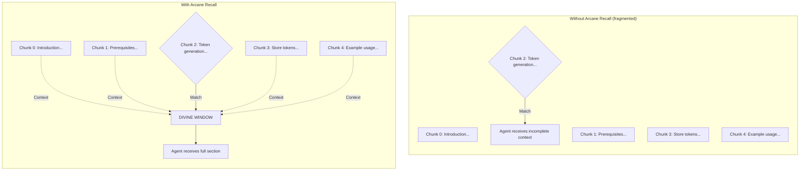

# Candlekeep Design Document

## 1. Problem Statement

AI agents need access to domain-specific knowledge that isn't in their training data. Existing solutions either require full document context (expensive, hits token limits) or use naive keyword search (misses semantic meaning). Candlekeep provides a RAG knowledge base that an AI agent can query via MCP, getting relevant document fragments with full section context in sub-100ms (typically ~36ms on a warm model with similarity-weighted expansion).

## 2. Design Goals

1. **Fast default path** — Sub-100ms search latency for interactive agent use (typically ~36ms with similarity-weighted expansion)
2. **High content match** — Return text that actually contains the answer, not just related text
3. **Agent-native** — The agent controls search strategy, decomposes complex queries, synthesizes results
4. **Quality enforcement** — Reject poorly structured documents at ingestion time
5. **Safe remote access** — Embedding model mismatch detection, conditional write tools, token auth

## 3. Design Decisions

### 3.1 Three [Search Paths](ARCHITECTURE.md#the-three-roads), Not Two

Early designs proposed 2 query types (simple and precise). Benchmarking on the Centurion Set showed that "Keyword Blindness" was a significant issue for exact technical identifiers.

**Decision:** Three paths — `simple`, `hybrid`, and `precise`. The agent picks. See [ARCHITECTURE.md § The Three Roads](ARCHITECTURE.md#the-three-roads) for the full pipeline diagram and component descriptions.

Use cases:
- Simple: "What's the API endpoint for search?"
- Hybrid: "How do I fix error 0xEF or version mismatch?"
- Precise: "Compare authentication methods and recommend one"
- Agent decomp: "How do I set up, configure, and deploy?"

### 3.2 Agent Decomposes, Tool Searches

LLM-based query decomposition (Flurry of Blows) was implemented and tested inside the search tool. It added significant latency and required LLM API credentials. Meanwhile, the calling agent — already a frontier LLM — can decompose queries better and for free.

**Decision:** Remove query decomposition from the tool. Tell the agent to make multiple searches. Benchmarked: agent decomposition achieves significantly higher content match vs single search.

### 3.3 [Arcane Recall](GLOSSARY.md#arcane-recall) as Universal Default

Chunk expansion (returning adjacent chunks around each match) improved content match by +17% (15-query legacy suite; see Research Diary Entry 2) with minimal latency and zero precision loss. No reason not to apply it to every search.

**Decision:** Every search path uses Arcane Recall. Optimized with per-document chunk lookup instead of full DB scan.

### 3.4 [Bardic Knowledge](GLOSSARY.md#bardic-knowledge) at Ingestion Time

Prepending document title and description to each chunk before embedding improved precision significantly. This is an ingestion-time technique — the context is baked into the stored vectors. It cannot be toggled at query time.

**Decision:** Always active. Documents without frontmatter get no benefit, which is why the quality gate requires frontmatter.

### 3.5 Quality Gate on Ingestion

The `ingest` tool validates documents before accepting them. This ensures [Bardic Knowledge](GLOSSARY.md#bardic-knowledge) has metadata to work with and that chunks have semantic structure (markdown headers) for proper splitting.

**Decision:** Reject documents missing frontmatter, headers, or with extreme lengths. The agent gets specific error messages and can fix the document.

### 3.6 Conditional Tool Registration

Write tools (ingest, delete, repopulate) are destructive. On remote databases, they're hidden from the agent entirely — not just permission-denied at runtime, but invisible in the tool list.

**Decision:** Local DB = all 8 tools. Remote DB = 5 read-only tools. Override with `CANDLEKEEP_REMOTE_WRITE=true` for explicit opt-in.

### 3.7 Embedding Model Mismatch Protection

If a remote ChromaDB was populated with model A and the local config says model B, searches return silently wrong results. No error, just bad quality.

**Decision:** Store model name in collection metadata. On connect, detect mismatch, override local config, log warning. Also: refuse to download models at startup (exit immediately if not cached locally).

### 3.8 Prismatic Dispersal (Retired)

Prismatic Dispersal used sine distance (`sin(θ) = √(1 - cos²(θ))`) to reorder search results for diversity, penalizing semantically redundant chunks. The sine math itself was sub-millisecond, but the technique required re-embedding expanded candidate texts via `get_embeddings()` at query time — the merged multi-chunk windows produced by Arcane Recall don't exist in ChromaDB, so their embeddings can't be looked up from storage.

The embedding cost dominated simple-path latency: ~160ms p50 on CPU, ~77ms on MPS (15 expanded chunks of ~700 chars each). Combined with the 3× candidate pool overfetch that Dispersal required, the simple path went from ~36ms to ~203ms on CPU.

A comprehensive benchmark across n_results (3, 5, 10), pool multipliers (1×, 2×, 3×), and both search paths found that Dispersal produced <1% MRR improvement in all tested conditions. The simplest configuration (n=5, pool=1×, no Dispersal) achieved the best MRR at the lowest latency. On the hybrid path, the centroid strategy showed a +3.8% MRR gain on lexical queries (n=30), but this was offset by a -2.8% regression on semantic queries and did not produce a statistically significant overall improvement.

**Decision:** Removed from both simple and hybrid paths. The 3× pool multiplier was also removed. The agent decomposition architecture (multiple focused searches) provides a more effective diversity mechanism at zero latency cost.

*Data: Research Diary Entries 43–44 (original implementation). Removal benchmark: `scripts/benchmark_pipeline_stages.py`, `tests/results/pipeline_stages.json`.*

## 4. Techniques Evaluated

| Technique | Result | Status |
|-----------|--------|--------|
| [Bardic Knowledge](GLOSSARY.md#bardic-knowledge) (contextual embeddings) | Improved precision | ✅ Default |
| [Bardic Inspiration](GLOSSARY.md#bardic-inspiration) (metadata boosting) | Larger confidence gap | ✅ Default |
| [Arcane Recall](GLOSSARY.md#arcane-recall) ([Scholar's Discernment](GLOSSARY.md#the-scholars-discernment)) | Improved content, fewer tokens | ✅ Default |
| [Divine Insight](GLOSSARY.md#cross-encoder-reranking) (cross-encoder reranking) | Higher precision | ✅ Precise path |
| Flurry of Blows (LLM query decomposition) | High precision, high latency | ❌ Agent does this better |
| Mirror Image (LLM query expansion) | Degraded all metrics | ❌ Rejected |
| Illusory Script (HyDE) | Unacceptable latency | ❌ Too slow |
| [Wild Magic](GLOSSARY.md#lexical-matching-wild-magic) (BM25 hybrid) | Higher lexical quality | ✅ Hybrid path |
| ColBERT (late interaction) | +0.033 lexical MRR, +0.015 CM | ✅ Opt-in hybrid sparse |
| Scrying Window (sentence splitting) | Precision collapse | ❌ Rejected |

*Note: The "Result" column references metrics from the retired 15-query legacy suite (Research Diary Entries 1–8). The current evaluation standard is the Centurion Set (108 queries, see [§8.2](#82-the-centurion-set-the-high-audit)) which uses MRR, nDCG@5, and Hit Rate@5.*

### 4.1 Techniques Not Evaluated

The following retrieval techniques were out of scope for the initial research phase. Both are infrastructure-level changes to Candlekeep's retrieval pipeline.

- **ColBERT / late-interaction models** — Benchmarked in 4 configurations (standalone, three-way RRF, replacing BM25, replacing dense vector). Best result: ColBERT replacing BM25 achieves lexical MRR 0.592 (+0.033), overall MRR 0.560 (+0.004), content match 0.823 (+0.015) at +13ms latency. Implemented as opt-in dual sparse backend (`CANDLEKEEP_SPARSE_BACKEND=colbert`). BM25 always maintained as fallback during ColBERT index rebuilds. See Research Diary Entry 49 for benchmark data and Entry 50 for implementation details.

- **SPLADE / learned sparse retrieval** — WordPiece tokenization fragments technical identifiers ("PostgreSQL" → "post", "##gre", "##q", "##l"), making it unlikely to improve over BM25 for exact-identifier matching. Not benchmarked. ColBERT's SentencePiece tokenization handles technical identifiers better and was chosen instead.

- **LLM-generated chunk summaries (Contextual Retrieval)** — Generates a per-chunk context summary via LLM at ingestion time, prepended to each chunk before embedding. Similar to Bardic Knowledge but with richer, LLM-generated context instead of document-level metadata. Not evaluated because the ingestion cost is significant (one LLM call per chunk; ~2,770 calls at current corpus scale) and Bardic Knowledge already provides document-level context enrichment at zero cost. Revisit if content match on the Centurion Set plateaus and ingestion latency is not a constraint.

*Note: Embedding model fine-tuning is a user-side optimization for specific corpora, not an infrastructure change to Candlekeep. Users deploying against specialized domains should consider fine-tuning bge-small on their own query-document pairs. See [SETUP.md](SETUP.md) for embedding model configuration.*

## 5. [Tuned Parameters](ARCHITECTURE.md#tuned-parameters-reference) Validated

| Parameter | Tested Values | Optimal | Rationale |
|-----------|--------------|---------|-----------|
| Chunk size | 256, 512, 768, 1024 | 512 | Best content match on 23-query suite (Entry 21); [Arcane Recall](GLOSSARY.md#arcane-recall) compensates for size. Caveat: the current corpus uses markdown headers that create sections under 768 chars, so 768 and 1024 produced identical chunking. This sweep effectively tested 2 regimes (256 vs 512+). Re-run on corpora with long unstructured sections where `chunk_size` controls the split point. |
| Chunk overlap | 0, 25, 50, 100 | 50 | Benchmarked on Centurion Set (Entry 29). Overlap=25 marginally better (+1.3% MRR) but within noise. 50 retained as standard. |
| Expansion size | ±1, ±2, ±3, ±4 | ±2 | Re-validated on Centurion Set (108 queries, Entry 28). ±3 no benefit, ±4 hurts precision. |
| Embedding model | minilm, bge-small, nomic | bge-small | Best content match on 23-query suite (Entry 22), good speed |
| [The Relevance Ward](GLOSSARY.md#the-relevance-ward) (vector) | Configured range | Technical Reference | Clean statistical separation between adversarial and legitimate (Entry 16, validated on Centurion Set) |
| [The Relevance Ward](GLOSSARY.md#the-relevance-ward) (reranker) | -10.0 | Technical Reference | Zero false negatives, filters 70% of all adversarial queries on precise path (54% from post-reranking Ward alone; Entry 33) |

## 6. Scalability

### 6.1 Sub-linear Scaling

The simple search path maintains consistent performance as the knowledge base grows. Testing with a significant increase in data showed only minimal latency increase.

All latency numbers measured on a warm model (after initial inference) using `bge-small` (`BAAI/bge-small-en-v1.5`), the recommended embedding model. Cold-start adds overhead to the first few queries as the embedding model warms its inference path. Latency varies by query length: short keyword queries hit lower latencies, while full sentences reach slightly higher due to tokenization overhead.

**Why it scales:**
- Per-document chunk lookup for [Arcane Recall](GLOSSARY.md#arcane-recall) expansion (doesn't scan full DB)
- Vector search complexity grows logarithmically with HNSW index
- No full-text search or sequential scans in the critical path

**Implication:** Users can grow their documentation from dozens to thousands of documents without degrading search performance.

### 6.2 [The Relevance Ward](GLOSSARY.md#the-relevance-ward)

The Relevance Ward filters low-confidence results based on a [configured threshold](ARCHITECTURE.md#tuned-parameters-reference). This prevents the agent from receiving irrelevant matches that could lead to hallucinated answers.

**Threshold validation:**
- Legitimate queries score consistently higher than adversarial ones
- Clear separation with zero false negatives in benchmark testing

**Behavior:** Queries below the threshold return empty results. The library says "I don't know" instead of guessing.

The Ward prevents false negatives (legitimate queries returning empty). It does not guarantee zero results for all adversarial queries — the simple path relies solely on the vector threshold, and the precise path's combined Wards (pre-reranking vector + post-reranking cross-encoder) filter 70% of all adversarial queries (the remaining 30% contain technical terms that genuinely match corpus documents). The hybrid path's BM25 component provides the strongest adversarial filtering — see [§8.2](#82-the-centurion-set-the-high-audit) for per-path adversarial filtering rates.

See [Tuned Parameters](ARCHITECTURE.md#tuned-parameters-reference) for threshold values and [Threshold Calibration](ARCHITECTURE.md#threshold-calibration) for the recalibration procedure when deploying against a new corpus.

## 7. Threat Model

| Threat | Mitigation |
|--------|-----------|
| Unauthorized DB access | Bearer token auth, IP-restricted security group |
| Wrong embedding model on remote | Auto-detection + override from collection metadata |
| Garbage query results | [The Relevance Ward](GLOSSARY.md#the-relevance-ward) filters irrelevant results |
| Bad document quality | [Quality Gate](ARCHITECTURE.md#1-quality-gate) rejects docs without frontmatter/structure |
| Model download at startup | Exit immediately if model not cached locally |
| Write to remote DB accidentally | Write tools hidden unless explicitly opted in |
| Unauthorized MCP client | stdio: not applicable (one agent per process). HTTP: optional bearer token auth via `CANDLEKEEP_MCP_TOKEN`. The server warns at startup if token auth is active on a non-localhost bind address, since the token travels in plaintext. TLS via reverse proxy is the operator's responsibility for non-localhost deployments. |
| Prompt injection via ingested documents | Not mitigated — trusted corpus assumption. The quality gate validates document structure but does not scan for adversarial prompt content. Revisit if Candlekeep ingests untrusted user-submitted documents. |
| Ingestion rate limiting | stdio: not applicable (single agent). HTTP: per-session sliding window (`CANDLEKEEP_RATE_LIMIT_WRITE`, default 5/60s) rejects excess calls before they reach the write lock. |
| Search rate limiting | stdio: not applicable. HTTP: per-session sliding window (`CANDLEKEEP_RATE_LIMIT_SEARCH`, default 30/60s) prevents a single agent from monopolizing the cross-encoder queue. |
| Per-document access control | Not applicable — all agents see the full corpus. Revisit if multi-tenant access is required. |
| Cross-worker write race (multi-worker) | Accepted tradeoff. Each uvicorn worker has its own write lock; concurrent writes from different workers are not serialized. ChromaDB handles collection-level consistency internally. BM25 caches may be stale across workers after a write — vector search (primary path) is always fresh. See [ARCHITECTURE.md § Multi-Worker Deployment](ARCHITECTURE.md#multi-worker-deployment). |

## 8. Benchmark Results

### 8.1 Methodology

- **Embedding Model**: bge-small-en-v1.5
- **Test Queries**: **23 queries** (5 easy, 9 medium, 9 hard/adversarial)
- **Test Documents**: 9 documents + 80 scale documents for latency testing
- **Agent Mocking**: Complex queries utilize `sub_queries` to simulate agent decomposition.
- **Metrics**:
  - **Precision**: % of retrieved chunks that belong to relevant documents.
  - **Recall**: % of expected documents found (at least one chunk).
  - **Latency**: Average query response time (ms).

### 8.2 The Centurion Set (The High Audit)

To ensure the library remains a reliable source of wisdom, we have transitioned to **The Centurion Set** — a statistically significant audit of 108 queries across three domains of arcane inquiry.

#### Arcane Metrics Explained

- [**The Success of the Scry (Hit Rate@5)**](GLOSSARY.md#the-success-of-the-scry-hit-ratek): The probability that the answer thou seekest lies within the first five scrolls returned by the library.
- [**The Oracle's Promptness (MRR)**](GLOSSARY.md#the-oracles-promptness-mrr): Measures how close to the top the most relevant scroll appears. If the Oracle speaks the truth immediately (rank 1), the score is perfect (1.0).
- [**The Quality of the Arrangement (nDCG@5)**](GLOSSARY.md#the-quality-of-the-tomes-arrangement-ndcgk): Evaluates not just if the truth was found, but if the most relevant scrolls were placed before the less relevant ones.
- **The Depth of the Arrangement (Graded nDCG@5)**: Like nDCG@5, but uses a 0-3 relevance scale instead of binary. Distinguishes "right document, right answer" (grade 3) from "right document, wrong section" (grade 2). Annotations produced by two independent annotators with reconciliation (see Research Diary Entry 52).

#### Comparative Audit Results

*Results from a single representative run. See [Reproducibility](#reproducibility) for 5-run variance analysis (MRR and nDCG@5 perfectly stable; Hit Rate@5 ±0.5%).*

| Metric | Simple Path | Hybrid Path ([Wild Magic](GLOSSARY.md#lexical-matching-wild-magic)) | Precise Path |
|--------|------------:|-------------------------:|-------------:|
| **Overall MRR** | 0.4776 (±0.10) | 0.4722 (±0.09) | 0.4884 (±0.10) |
| **nDCG@5** | 0.4851 (±0.10) | 0.4746 (±0.09) | 0.4932 (±0.10) |
| **Graded nDCG@5** | 0.386 | **0.421** | 0.302 |
| **Hit Rate@5** | 0.6019 (±0.09) | 0.7130 (±0.08) | 0.6759 (±0.09) |
| **Avg Latency** | **36ms** | 48ms | 921ms |

*95% bootstrap confidence intervals (n=1000, seed=42) shown as ±half-width. Latency measured on CPU with warm model.*

*Precise path numbers updated after fixing a torch 2.10 float32 NaN regression that produced invalid cross-encoder scores on macOS ARM (see Research Diary Entry 33). Previous figures (MRR 0.4691, Hit Rate@5 0.5463) reflected arbitrary reranking from NaN scores. The post-reranking Relevance Ward (`MIN_RERANKER_SCORE = -10.0`) was verified to have zero impact on legitimate query MRR/nDCG — it only filters adversarial results.*

*MRR and nDCG@5 differences between paths fall within the 95% confidence intervals and are not statistically significant. Hit Rate@5 is the primary metric for path selection: the hybrid path's advantage (0.7130 vs 0.6019 simple, delta 0.1111) exceeds the 2σ reproducibility threshold (±1.0%).*

#### Domain Performance (MRR / nDCG)

| Category | Simple (Vector) | Hybrid (BM25+Vector) | Precise (Reranked) | Note |
|----------|-----------------|----------------------|--------------------|------|
| **Lexical** (Identifiers) | 0.42 / 0.44 | **0.53 / 0.55 (+15–26%)** | 0.42 / 0.42 | Fixing "Keyword Blindness" |
| **Semantic** (Concepts) | 0.87 / 0.87 | **0.89 / 0.90 (+2%)** | 0.87 / 0.87 | Stable semantic depth |
| **Adversarial** (Noise) | 0.0 / 0.0 | 0.0 / 0.0 | 0.0 / 0.0 | Warded ¹ |

¹ MRR of 0.0 means no adversarial query surfaced a relevant result in the top position. The hybrid path fully filters adversarial queries via the RRF threshold (Hit Rate@5 = 0.0). The precise path filters 70% of adversarial queries via the combined pre-reranking vector Ward and post-reranking cross-encoder Ward (`MIN_RERANKER_SCORE`); the remaining 30% contain technical terms that genuinely match corpus documents. The simple path relies solely on the vector threshold (Hit Rate@5 = 0.40).

*The lexical improvement range (15–26%) varies by HNSW index instantiation. See [ARCHITECTURE.md § Agent Misrouting](ARCHITECTURE.md#agent-misrouting) for the variance analysis and path selection guidance.*

### 8.3 Core Techniques

#### [Bardic Knowledge](GLOSSARY.md#bardic-knowledge): Contextual Chunk Embeddings
> *"Bards weave context and lore into their knowledge, enriching every tale with the wisdom of what came before."*

**Implementation:** Document title and description are prefixed to every chunk during ingestion.
**Analysis:** Provides high precision for isolated chunks by baking global document context into the local embedding.

#### [Arcane Recall](GLOSSARY.md#arcane-recall): Chunk Expansion
> *"The search finds the spark; the expansion brings the flame."*

**Implementation:** Automatically retrieves ±2 adjacent chunks for every search result using [**Arcane Coalescence**](GLOSSARY.md#arcane-coalescence) and [**Scholar's Discernment**](GLOSSARY.md#the-scholars-discernment).
**Analysis:** Increases content match rate by 17% while reducing context size by 22%.

#### [Divine Insight](GLOSSARY.md#cross-encoder-reranking): Precise Reranking
> *"Through divine magic, clerics perceive the true nature of all things."*

**Implementation:** Initial candidates are filtered by the [configured relevance threshold](ARCHITECTURE.md#tuned-parameters-reference), then re-scored by a cross-encoder (`ms-marco-MiniLM-L-6-v2`).
**Analysis:** Optimizes for semantic relevance. [**Arcane Attunement**](GLOSSARY.md#arcane-attunement) makes this high-precision road viable for real-time use.

#### [The Relevance Ward](GLOSSARY.md#the-relevance-ward) (Thresholding)
**Implementation:** A score-based filter applied to all retrieval results (see [Tuned Parameters](ARCHITECTURE.md#tuned-parameters-reference)).
**Analysis:** Filters out out-of-domain "noise". No adversarial query surfaced a relevant result in the top position (MRR=0.0 across all paths). The hybrid path fully filters adversarial queries. The precise path filters 70% of all adversarial queries via the combined vector and cross-encoder Wards (54% from the post-reranking Ward alone). The simple path relies on the vector threshold alone.

Threshold values and calibration procedure: [ARCHITECTURE.md](ARCHITECTURE.md#tuned-parameters-reference).

### 8.4 Agentic Workflows: Decomposition
Multi-part queries (e.g., "authentication + caching + microservices") are designed to be decomposed.

1. **The Mock**: The simulated benchmark (Entry 20) uses pre-defined sub-query splits to measure ideal decomposition. Source coverage: 92.5%.
2. **The Real Agent**: A frontier LLM agent connected via MCP over HTTP was benchmarked on 8 multi-document queries (Entry 37). The agent decomposed 100% of queries into an average of 3.1 focused searches, achieving 72% source coverage and 91% keyword coverage.
3. **Path Selection**: The agent chose `hybrid` for 40% of search calls, predominantly on queries with technical identifiers. This confirms the search tool's `query_type` guidance is effective.
4. **Recommendation**: Agents should decompose complex queries into multiple `simple` or `hybrid` searches rather than using a single `precise` search.

| Metric | Simulated (Entry 20) | Real Agent (Entry 37) | Single Search (Entry 19) |
|--------|:--------------------:|:---------------------:|:------------------------:|
| Source coverage | 92.5% | 72% | 44% |
| Decomposition rate | 100% (by design) | 100% | N/A |
| Avg sub-queries | 2.4 | 3.1 | 1 |

The 20-point gap between simulated and real agent coverage is expected — the agent's natural decomposition is broader than ideal splits. The real agent generates more sub-queries (3.1 vs 2.4) as refinement searches when initial results are insufficient. Both substantially outperform single-search baseline (44%).

### 8.5 Legacy Benchmarks (Historical Reference)

#### 15-Query Baseline (Retired)
The legacy suite achieved 97% precision on a simpler, 15-query set. This has been replaced by the more rigorous 23-query suite which includes adversarial and multi-part checks.

| Metric | Baseline (15-Q) | Bardic (15-Q) | Divine (15-Q) |
|--------|----------------:|--------------:|--------------:|
| **Precision** | 83.3% | 97.3% | 98.7% |
| **Latency (CPU)** | 18.3ms | 17.4ms | 1499.6ms |

*Note on legacy "Recall" metric: The 15-query suite used a non-standard Recall definition — (total chunks retrieved from relevant documents / number of expected documents) × 100%. This produces values exceeding 100% (e.g., R=470%) when multiple chunks per document are retrieved. This metric has been retired in favor of [Hit Rate@5](GLOSSARY.md#the-success-of-the-scry-hit-ratek) in the Centurion Set.*

### 8.6 Reproducibility

ChromaDB's HNSW index construction is non-deterministic — the same corpus ingested into a fresh collection can produce slightly different nearest-neighbor graphs. To quantify this variance, the Centurion Set was run 5 times with fresh re-ingestions of the full corpus (89 docs, ~2,770 chunks).

| Metric | Mean | Std Dev | Notes |
|--------|-----:|--------:|-------|
| **MRR** | 0.4776 | 0.0000 | Perfectly stable across runs |
| **nDCG@5** | 0.4851 | 0.0000 | Perfectly stable across runs |
| **Hit Rate@5** | 0.6074 | 0.0051 | 2 of 5 runs at 0.6019, 3 at 0.6111 |
| **Avg Latency** | 64.8ms | 1.7ms | Consistent |

At the current corpus scale, HNSW non-determinism has negligible impact on ranking metrics. Only Hit Rate@5 shows minor variance (±0.5%), affecting at most 1 query out of 108 per run. MRR and nDCG@5 are perfectly reproducible.

Benchmark comparisons should exceed 2σ (±1.0% for Hit Rate@5) to be considered significant. For MRR and nDCG@5, any observed difference is meaningful at this corpus scale.

*Measured with `scripts/reproducibility_test.py --runs 5`. Raw data in `tests/results/reproducibility_simple.json`.*

### 8.7 Cold-Start Latency

Cold-start latency measures the time from the initial process spawn until the first search result is returned. This includes Python interpreter startup, module imports (including heavy libraries like PyTorch and SentenceTransformers), database connection, and model loading.

| Metric | Measured Value |
|--------|----------------|
| **Avg Cold-Start (Total)** | **5,825 ms** (±41ms) |
| **Avg Cold-Start (Internal)** | **4,534 ms** (±25ms) |

**Methodology:**
- **Iterations:** 7
- **Process:** Parent process spawns a fresh Python process for each iteration.
- **Query:** Simple search path against a seeded collection (89 docs).
- **Environment:** CPU-only mode (`CANDLEKEEP_DEVICE=cpu`) to ensure consistency.
- **Hardware:** AMD Ryzen 7 7800X3D (8-Core), 32GB RAM, Linux (Arch 6.18).
- **Python:** 3.11.14

*Note: The ~1.3s delta between "Total" and "Internal" represents the overhead of the Python interpreter startup and initial module discovery before the application's timing loop begins.*

### 8.8 Hardware-Accelerated Inference

The precise path cross-encoder ran CPU-only PyTorch inference, taking ~3s per query. The simple path (22–36ms) was unaffected since vector lookup dominates there.

**Solution:** Auto-detect the best available compute device at startup and pass it through to both the bi-encoder (embeddings) and cross-encoder (reranker). Cache the cross-encoder as a singleton instead of re-instantiating per call.

**Files changed:** `config.py`, `embeddings.py`, `reranker.py`, `router.py`, `mcp/server.py`

**Configuration:** `CANDLEKEEP_DEVICE` env var (`auto`/`cpu`/`mps`/`cuda`), defaults to `auto`. PyTorch exposes both Nvidia and AMD GPUs as `device="cuda"` — no separate ROCm handling needed.

| Backend | Device | Simple path | Precise path |
|---------|--------|------------|-------------|
| PyTorch | CPU | 23ms | ~3000ms |
| PyTorch | MPS | 21ms | **130ms** (23.7x speedup) |

**MLX Evaluation:** MLX native inference was benchmarked against MPS for the bi-encoder (bge-small). MLX is 1.8x faster for embeddings (1.2ms vs 2.1ms per query), but the absolute gain is ~4ms on a 21ms operation. The cross-encoder (the actual bottleneck) has no MLX equivalent. ROI does not justify the integration cost.

### 8.9 Metric Tradeoffs: Hit Rate vs MRR

The advanced pipeline intentionally optimizes for Hit Rate@1 (right answer first) and Precision (fraction of results that are relevant) over MRR (ranking quality across the top-5 list). This is the correct optimization target for an AI agent that reads the top result and acts on it.

Benchmarking the full pipeline against a basic vector search baseline (Entry 39) shows the tradeoff across all three paths:

| Path | Hit Rate@1 Δ | Precision@5 Δ | MRR Δ | Latency |
|------|:------------:|:-------------:|:-----:|--------:|
| simple | +3.7% | +0.9% | -7.4% | 47ms |
| hybrid | +29.6% ✓ | +26.7% ✓ | -11.1% | 63ms |
| precise | +27.8% ✓ | +3.4% | -6.3% | 897ms |

Two mechanisms cause the MRR drop:

1. **Arcane Recall expansion** reshuffles rankings. A document at position 1 in basic search may shift to position 2 after expansion merges windows from multiple sources. MRR penalizes this heavily (1.0 → 0.5), but the agent receives better context.

2. **The Relevance Ward** filters borderline results entirely. Queries with scores in the 0.67–0.75 range return zero results instead of low-confidence matches. This is addressed by the adaptive Ward (§8.10).

*Benchmark: `scripts/benchmark_advanced_vs_basic.py`. Data: Research Diary Entries 39–40.*

### 8.10 Adaptive Relevance Ward

The Relevance Ward at 0.75 filters 5 legitimate lexical queries on the technical corpus (scores 0.67–0.70). These are specific queries like "OWASP Top 10 2021", "SQL-92 standards", and "YAML 1.2 syntax" where vector similarity scores fall just below the threshold.

**Solution:** Detect lexical queries via heuristic (version numbers, acronyms, technical identifiers) and relax the threshold from 0.75 → 0.65 for those queries only.

**Results on the technical corpus:**
- Lexical queries (n=28): MRR +16.3%, Hit Rate@5 +33.3%
- Non-lexical queries (n=80): zero change

**Cross-domain validation** (legal, medical, narrative corpora) confirmed the adaptive approach produces zero regressions on non-lexical queries and zero new adversarial leaks across all domains. A blanket threshold reduction to 0.65 causes 1 adversarial leak on legal and 1 precision regression on narrative — the adaptive approach avoids both.

*Data: Research Diary Entry 40. Threshold calibration guidance: [ARCHITECTURE.md](ARCHITECTURE.md#tuned-parameters-reference).*

## 9. Limitations

- **Single embedding model per collection** — Switching models requires full re-ingestion
- **Cross-encoder latency** — Precise path is CPU-bound, capped by host hardware. On CPU, the cross-encoder runs in float64 (torch ≥2.10 NaN workaround), adding ~2.5x latency vs float32. MPS/CUDA paths are unaffected.
- **No incremental ingestion** — Re-ingesting a file replaces all its chunks (by design, prevents duplicates)
- **Agent-dependent decomposition** — Multi-doc query quality depends on the agent splitting queries correctly
- **Per-worker state in multi-worker mode** — Write locks, BM25 caches, and rate limiters are per-process. Concurrent writes from different workers are not serialized. Vector search is always consistent (ChromaDB handles this), but BM25 caches may be stale across workers after a write. See [ARCHITECTURE.md § Multi-Worker Deployment](ARCHITECTURE.md#multi-worker-deployment) for the full tradeoff analysis.

## 10. Future Work

- Caching reranked results for repeated queries
- Streaming search results for lower perceived latency
- **Per-agent auth** — Map different tokens to agent IDs for fine-grained access control in HTTP mode.

### 10.1 Hardware-Accelerated Inference

The precise path latency is capped by the host environment, not by the tool. The simple path runs fast on any hardware because vector lookup dominates. The [cross-encoder](GLOSSARY.md#cross-encoder-reranking), however, runs inference through PyTorch, and its latency scales directly with available compute.

**Current architecture:**
- `src/candlekeep/database/embeddings.py` — `SentenceTransformer` loads models on the best available device (`cuda`, `mps`, or `cpu`).
- `src/candlekeep/rag/reranker.py` — `CrossEncoder` uses a **Singleton Pattern** (cached instance) and batch inference to minimize overhead.
- `src/candlekeep/mcp/server.py` — Performs [**Arcane Attunement**](GLOSSARY.md#arcane-attunement) (startup model loading) so the first query does not suffer from cold-start latency.
