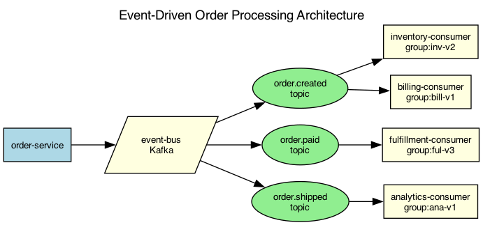

## Overview

The order processing system uses an event-driven architecture with domain events flowing through an event bus. Each bounded context subscribes to relevant events and maintains its own read model.

## Details

Refer to the diagram above for specific configuration details, component names, and measured values.
