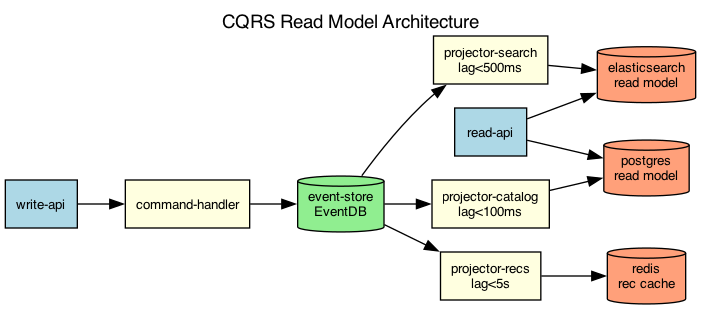

## Overview

The product catalog uses CQRS to separate write operations from read queries. Write commands update the event store, which projects into multiple optimized read models.

## Details

Refer to the diagram above for specific configuration details, component names, and measured values.
