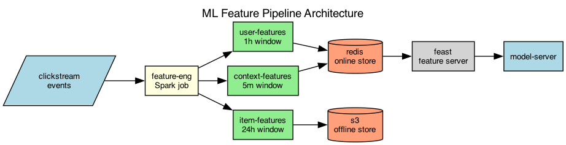

## Overview

The recommendation system's feature pipeline computes user and item features from raw event streams. Features are stored in an online store for low-latency serving and an offline store for training.

## Details

Refer to the diagram above for specific configuration details, component names, and measured values.
