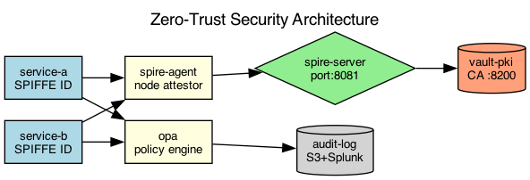

## Overview

The platform uses a zero-trust architecture where every service-to-service call is authenticated and authorized. Identity is established through short-lived certificates issued by the internal CA.

## Details

Refer to the diagram above for specific configuration details, component names, and measured values.
