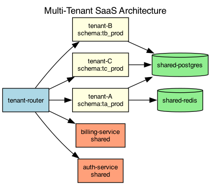

## Overview

The SaaS platform uses a shared infrastructure with logical tenant isolation. Each tenant has dedicated database schemas and isolated message queues.

## Details

Refer to the diagram above for specific configuration details, component names, and measured values.
