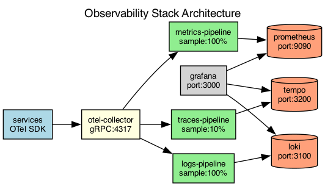

## Overview

The observability stack collects telemetry from all services using the OpenTelemetry collector. Data is routed to specialized backends based on signal type.

## Details

Refer to the diagram above for specific configuration details, component names, and measured values.
