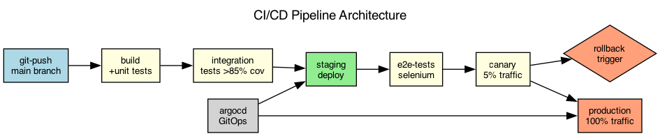

## Overview

The CI/CD pipeline uses a GitOps workflow with automated testing gates and progressive delivery. Deployments are promoted through environments based on test results.

## Details

Refer to the diagram above for specific configuration details, component names, and measured values.
