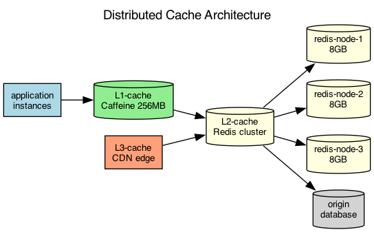

## Overview

The caching architecture uses a three-tier approach with local in-process caches, a distributed Redis cluster, and a regional CDN cache for static assets.

## Details

Refer to the diagram above for specific configuration details, component names, and measured values.
