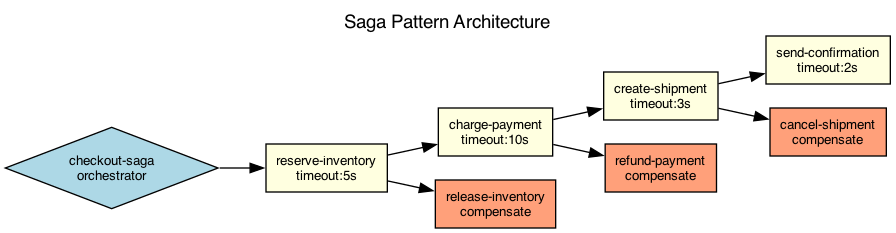

## Overview

The checkout flow uses the saga pattern to coordinate distributed transactions across multiple services. Each step has a corresponding compensating transaction for rollback.

## Details

Refer to the diagram above for specific configuration details, component names, and measured values.
