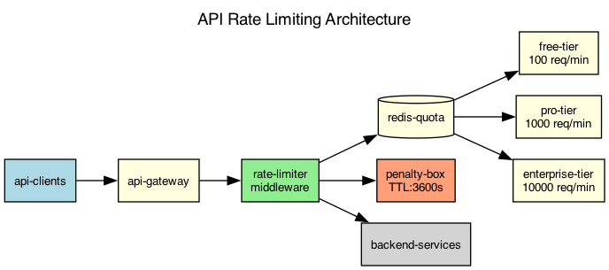

## Overview

The API rate limiting system uses a token bucket algorithm with per-customer quotas stored in Redis. Quota enforcement happens at the API gateway layer.

## Details

Refer to the diagram above for specific configuration details, component names, and measured values.
