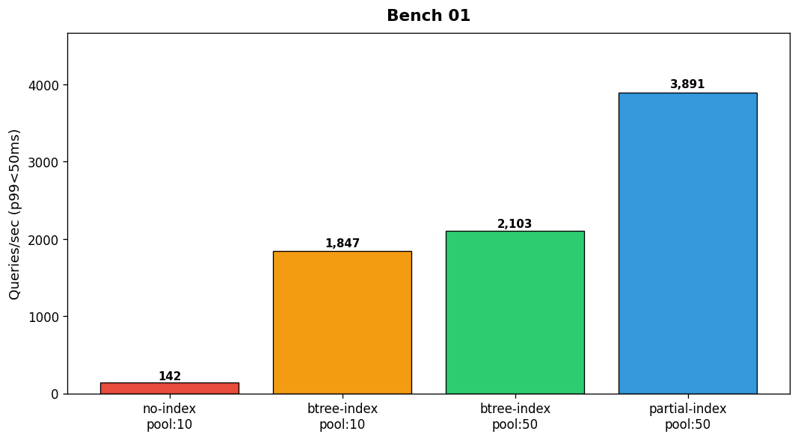

## Overview

The database team benchmarked query performance across four configurations varying index strategy and connection pool size. Results are measured in queries per second at p99 latency.

## Details

Refer to the diagram above for specific configuration details, component names, and measured values.
