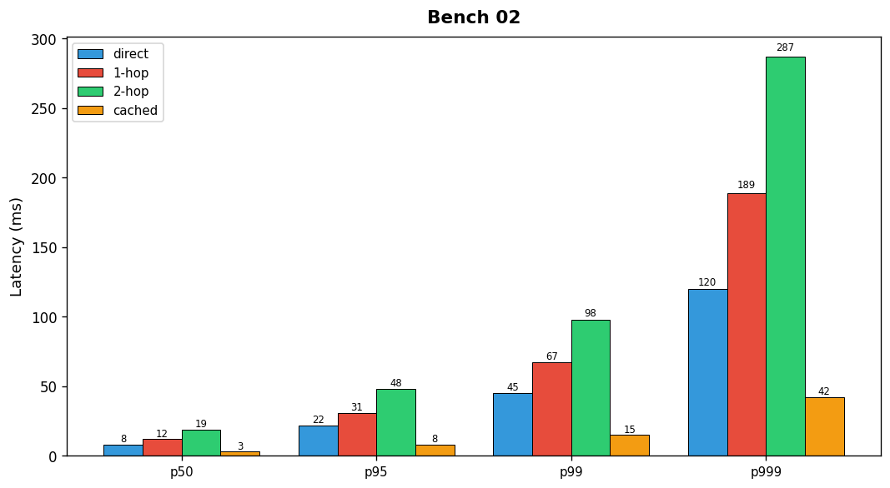

## Overview

The platform team measured end-to-end API latency across five routing configurations. Measurements were taken under sustained load of 1000 RPS.

## Details

Refer to the diagram above for specific configuration details, component names, and measured values.
