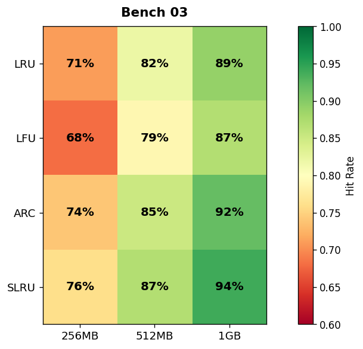

## Overview

The caching team evaluated four eviction policies across three cache sizes. Hit rates were measured over a 24-hour production traffic replay.

## Details

Refer to the diagram above for specific configuration details, component names, and measured values.
