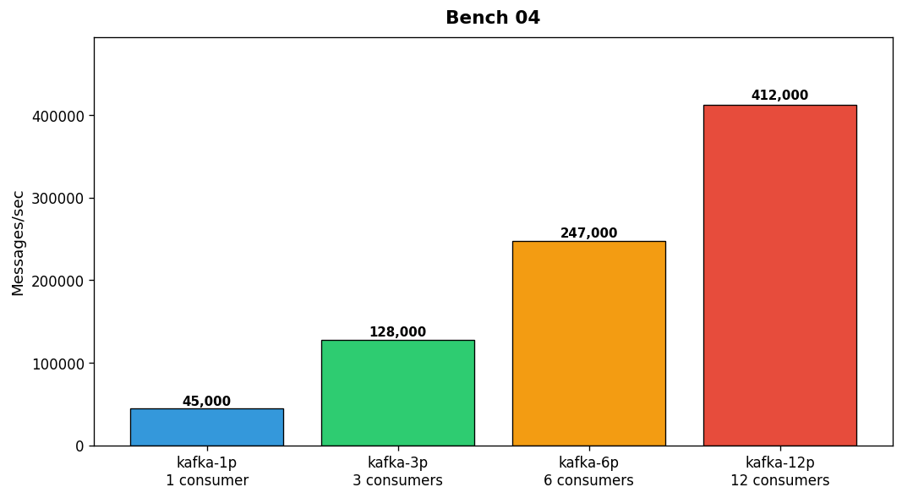

## Overview

The infrastructure team benchmarked message throughput for four queue configurations. Tests used 1KB messages with acknowledgment required.

## Details

Refer to the diagram above for specific configuration details, component names, and measured values.
