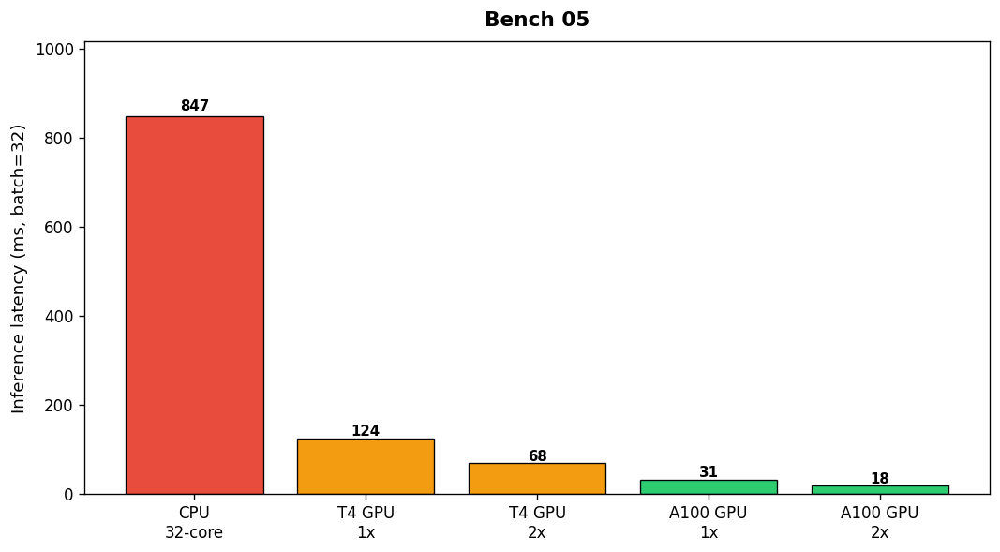

## Overview

The ML team benchmarked inference latency for the recommendation model across five hardware configurations. Batch size was fixed at 32 samples.

## Details

Refer to the diagram above for specific configuration details, component names, and measured values.
