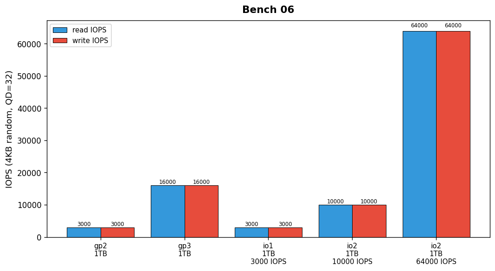

## Overview

The storage team measured read and write IOPS for five EBS volume configurations. Tests used 4KB random I/O with queue depth 32.

## Details

Refer to the diagram above for specific configuration details, component names, and measured values.
