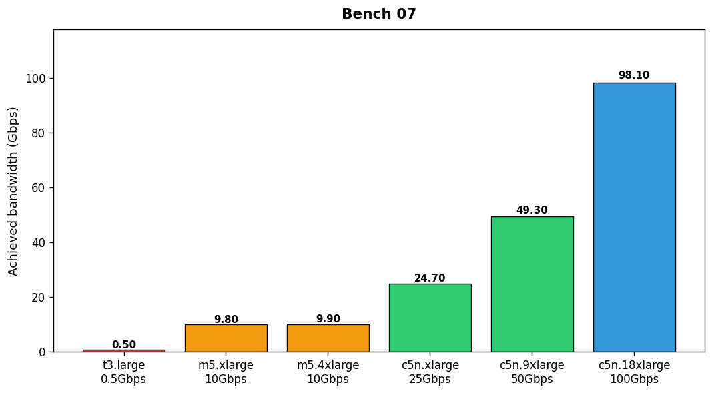

## Overview

The networking team measured achievable network bandwidth for six EC2 instance types under sustained TCP traffic. Tests used iperf3 with 8 parallel streams.

## Details

Refer to the diagram above for specific configuration details, component names, and measured values.
