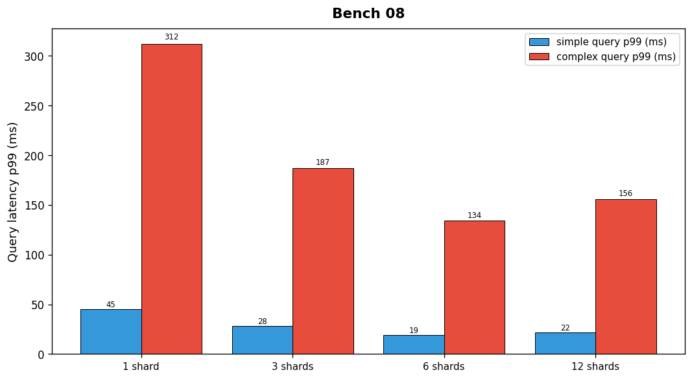

## Overview

The search team benchmarked query latency and throughput for the product search index across four shard configurations. Tests used a mix of simple and complex queries.

## Details

Refer to the diagram above for specific configuration details, component names, and measured values.
