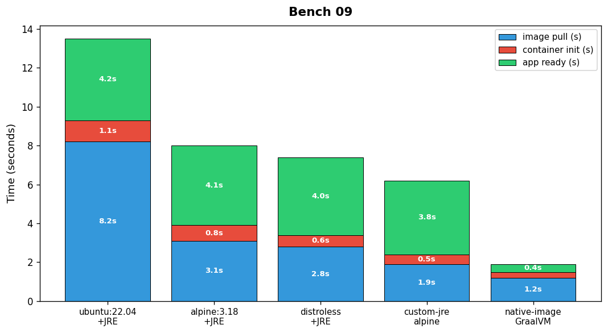

## Overview

The platform team measured container cold start times for five base image configurations. Times include image pull, container creation, and application ready state.

## Details

Refer to the diagram above for specific configuration details, component names, and measured values.
