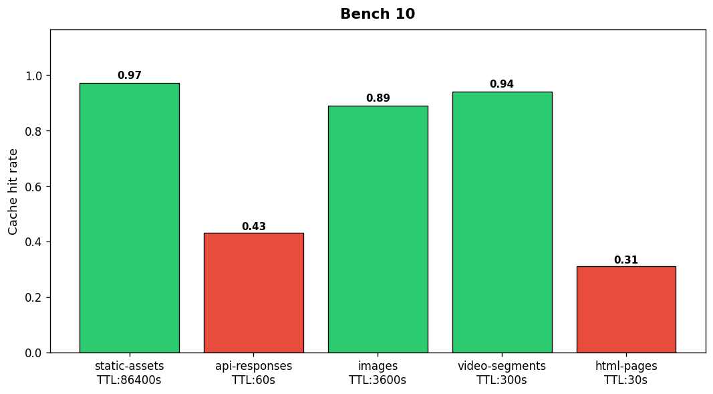

## Overview

The CDN team measured cache hit rates and origin offload percentages for five content configurations. Tests used 30 days of production traffic patterns.

## Details

Refer to the diagram above for specific configuration details, component names, and measured values.
