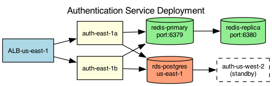

## Overview

The authentication service is deployed across two availability zones in a primary region with a warm standby in a secondary region. The topology uses an active-active configuration with session replication.

## Details

Refer to the diagram above for specific configuration details, component names, and measured values.
