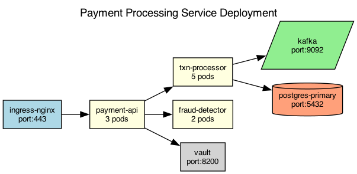

## Overview

The payment processing service runs on Kubernetes with horizontal pod autoscaling enabled. The service is split into separate pods for API handling, transaction processing, and fraud detection.

## Details

Refer to the diagram above for specific configuration details, component names, and measured values.
