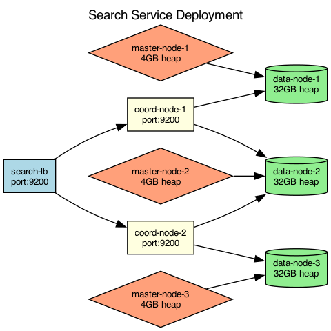

## Overview

The search service uses a dedicated Elasticsearch cluster with separate master, data, and coordinating nodes. The cluster is deployed behind a dedicated load balancer.

## Details

Refer to the diagram above for specific configuration details, component names, and measured values.
