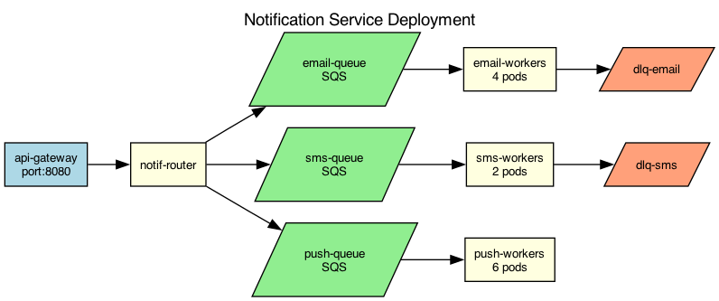

## Overview

The notification service handles email, SMS, and push notifications through dedicated worker pools. Each channel has independent scaling and retry logic.

## Details

Refer to the diagram above for specific configuration details, component names, and measured values.
