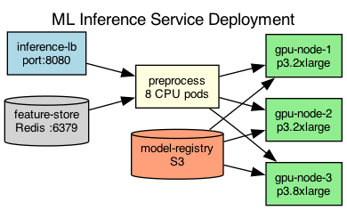

## Overview

The ML inference service uses a tiered deployment with CPU-based preprocessing and GPU-based model inference. Models are loaded from a shared model registry.

## Details

Refer to the diagram above for specific configuration details, component names, and measured values.
