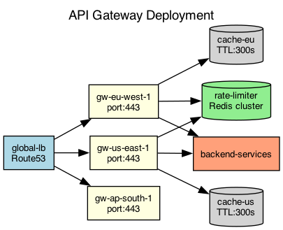

## Overview

The API gateway is deployed in three regions with local caching and centralized rate limiting. Traffic is routed based on latency and health checks.

## Details

Refer to the diagram above for specific configuration details, component names, and measured values.
