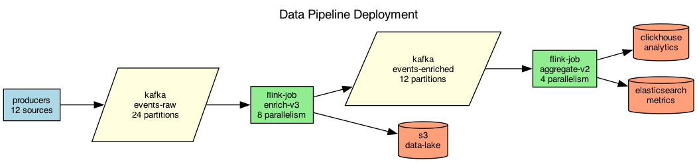

## Overview

The data pipeline ingests events from multiple sources, processes them through a stream processing layer, and writes results to multiple sinks.

## Details

Refer to the diagram above for specific configuration details, component names, and measured values.
