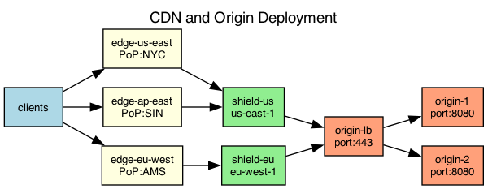

## Overview

The CDN deployment uses a two-tier caching architecture with regional origin shields to reduce load on the origin servers.

## Details

Refer to the diagram above for specific configuration details, component names, and measured values.
