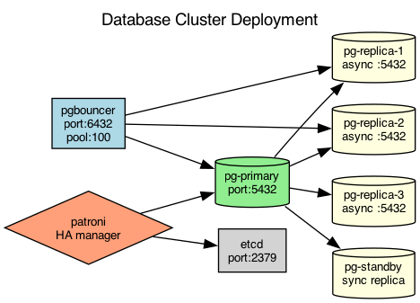

## Overview

The database cluster uses a primary-replica configuration with synchronous replication to a hot standby and asynchronous replication to read replicas.

## Details

Refer to the diagram above for specific configuration details, component names, and measured values.
