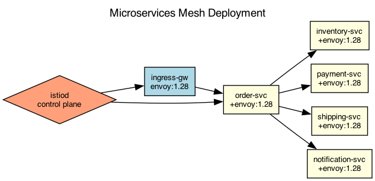

## Overview

The order management system uses a service mesh for inter-service communication with mutual TLS and circuit breaking. Services are deployed with sidecar proxies.

## Details

Refer to the diagram above for specific configuration details, component names, and measured values.
