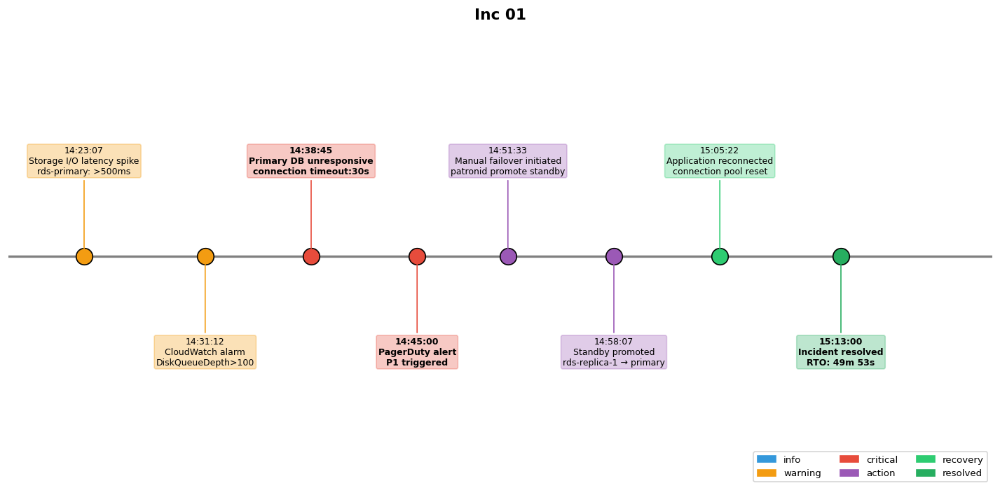

## Overview

A database failover incident occurred due to a storage volume degradation. The incident affected the primary database and required a manual failover to the standby replica.

## Details

Refer to the diagram above for specific configuration details, component names, and measured values.
