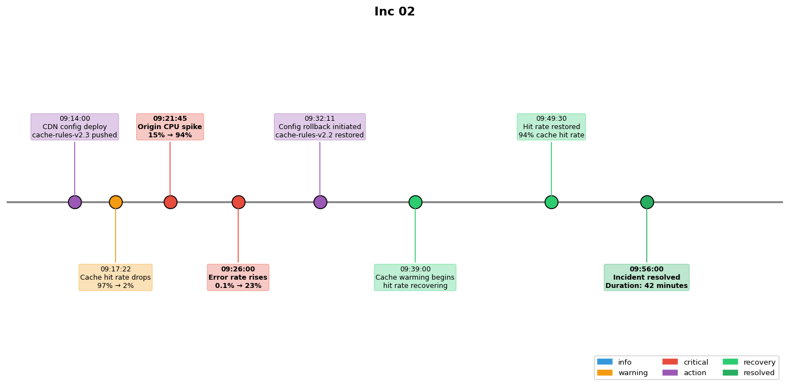

## Overview

A CDN outage was caused by an incorrect cache invalidation rule that purged all cached content simultaneously. The incident caused a 10x spike in origin traffic.

## Details

Refer to the diagram above for specific configuration details, component names, and measured values.
