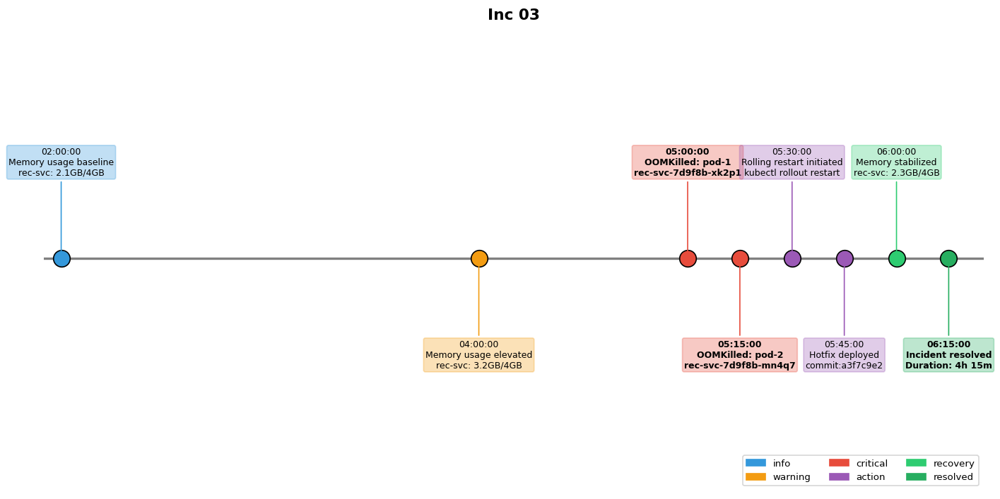

## Overview

A memory leak in the recommendation service caused gradual memory exhaustion across all pods. The incident required a rolling restart and a hotfix deployment.

## Details

Refer to the diagram above for specific configuration details, component names, and measured values.
