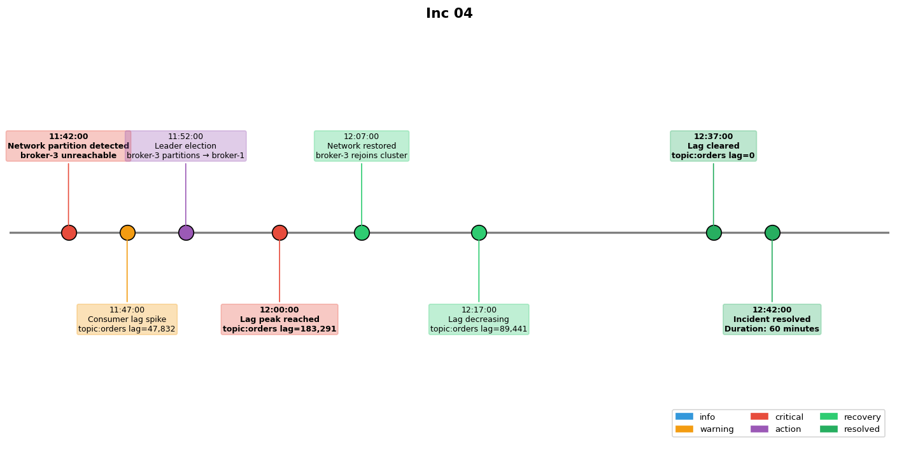

## Overview

A network partition isolated one Kafka broker from the cluster, causing consumer lag to accumulate and triggering downstream processing delays.

## Details

Refer to the diagram above for specific configuration details, component names, and measured values.
