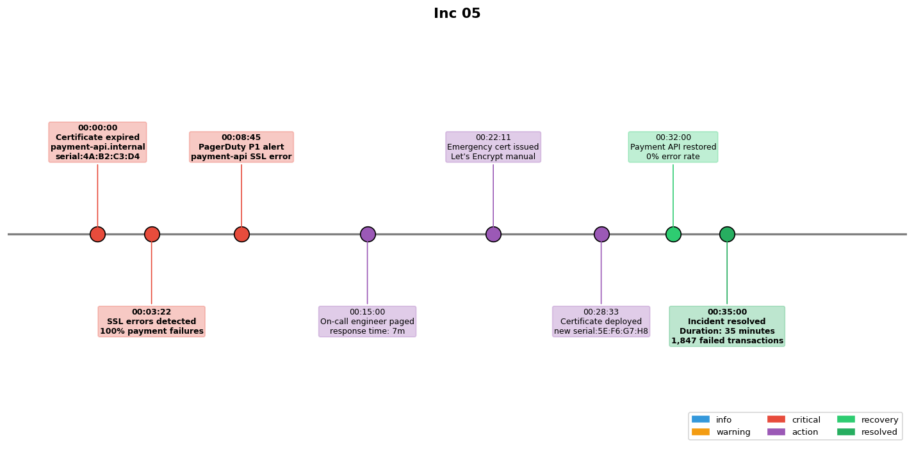

## Overview

A TLS certificate for the payment API expired due to a failed auto-renewal. The incident caused all payment transactions to fail with SSL handshake errors.

## Details

Refer to the diagram above for specific configuration details, component names, and measured values.
