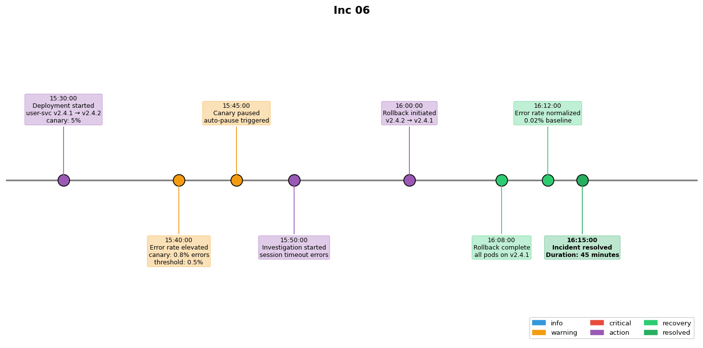

## Overview

A deployment of the user service introduced a regression in the session management code. The deployment was rolled back after error rates exceeded the SLO threshold.

## Details

Refer to the diagram above for specific configuration details, component names, and measured values.
