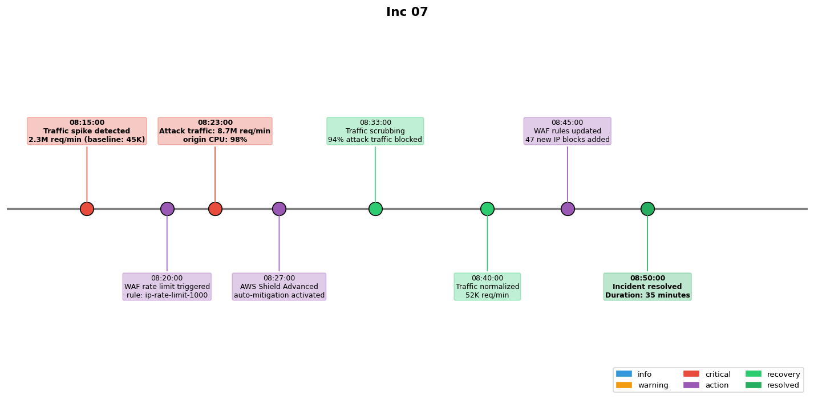

## Overview

A volumetric DDoS attack targeted the public API endpoint. The attack was mitigated through a combination of WAF rules and rate limiting.

## Details

Refer to the diagram above for specific configuration details, component names, and measured values.
