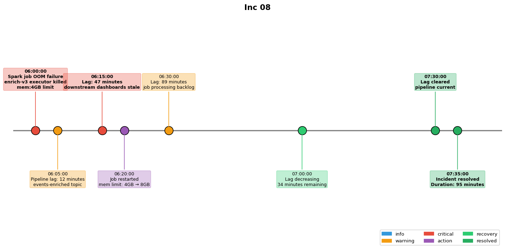

## Overview

A data pipeline lag incident occurred when a Spark job failed due to an out-of-memory error. The lag caused downstream dashboards to show stale data.

## Details

Refer to the diagram above for specific configuration details, component names, and measured values.
