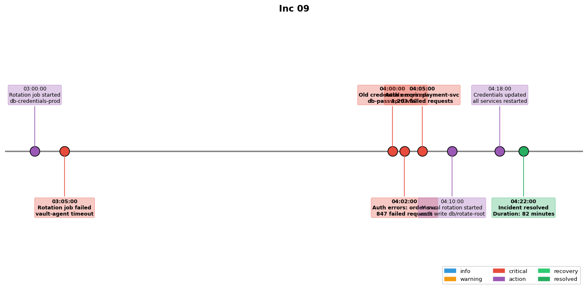

## Overview

An automated secret rotation job failed to update the database credentials in all services. Several services began failing with authentication errors after the old credentials expired.

## Details

Refer to the diagram above for specific configuration details, component names, and measured values.
