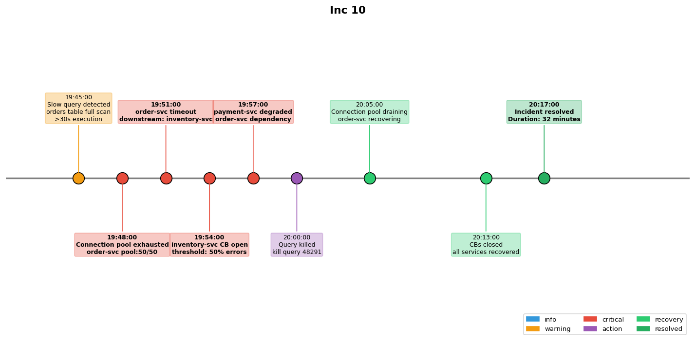

## Overview

A cascading failure was triggered by a slow database query that caused connection pool exhaustion in the order service, which then propagated to dependent services.

## Details

Refer to the diagram above for specific configuration details, component names, and measured values.
