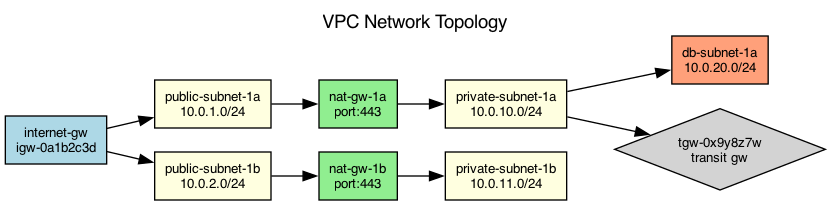

## Overview

The production environment uses a multi-AZ VPC with public and private subnets. Network traffic flows through NAT gateways and a transit gateway for cross-VPC communication.

## Details

Refer to the diagram above for specific configuration details, component names, and measured values.
