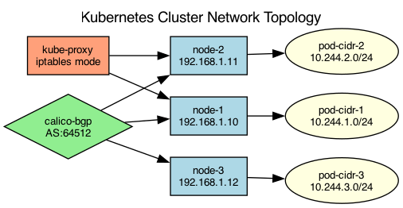

## Overview

The Kubernetes cluster uses a Calico CNI plugin with BGP routing between nodes. Pod-to-pod communication uses an overlay network with VXLAN encapsulation.

## Details

Refer to the diagram above for specific configuration details, component names, and measured values.
