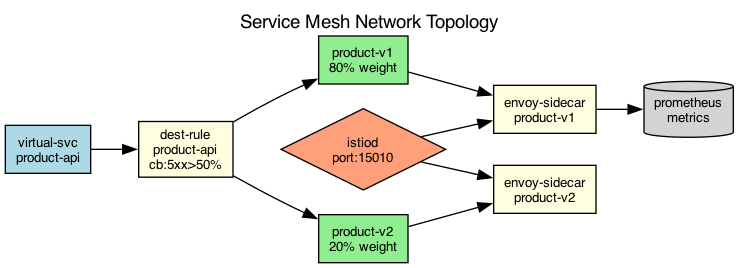

## Overview

The service mesh controls all east-west traffic between services using Envoy sidecar proxies. Traffic policies define routing rules, retries, and circuit breakers.

## Details

Refer to the diagram above for specific configuration details, component names, and measured values.
