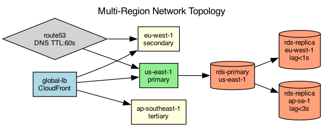

## Overview

The platform operates across three AWS regions with global load balancing and cross-region replication. Each region has an independent failure domain.

## Details

Refer to the diagram above for specific configuration details, component names, and measured values.
