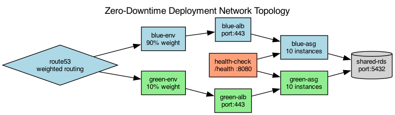

## Overview

The deployment uses a blue-green strategy with weighted DNS routing to shift traffic between environments. Health checks gate traffic promotion.

## Details

Refer to the diagram above for specific configuration details, component names, and measured values.
