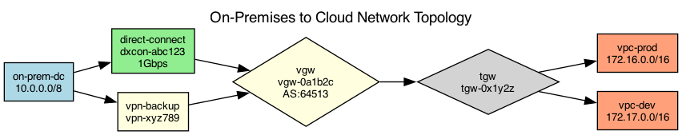

## Overview

The hybrid network uses AWS Direct Connect with a VPN backup for connectivity between the on-premises datacenter and the AWS VPC.

## Details

Refer to the diagram above for specific configuration details, component names, and measured values.
