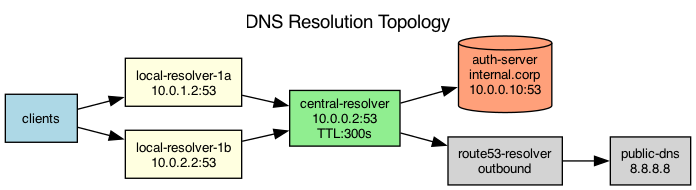

## Overview

The internal DNS system uses a hierarchical resolver topology with local caching resolvers in each AZ and a central authoritative server.

## Details

Refer to the diagram above for specific configuration details, component names, and measured values.
